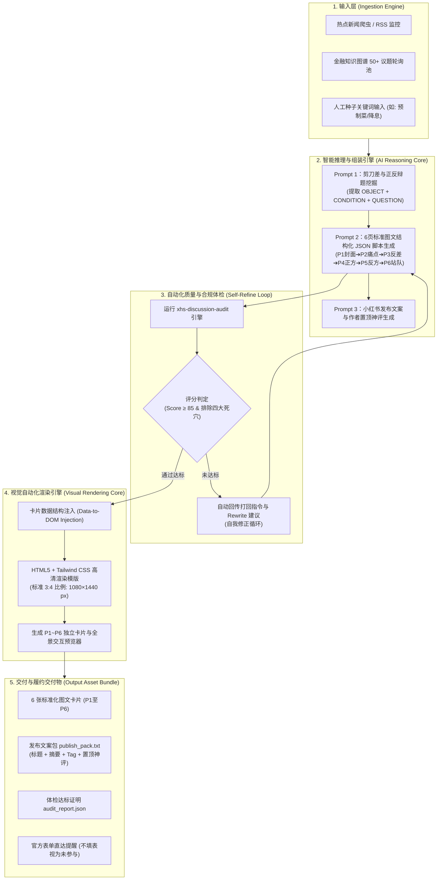

# 全自动化图文内容生产系统与工作流技术架构 (Automated Content Pipeline)

> **目标定位**：针对小红书等图文内容平台，构建**“输入一个关键词/热点，全自动输出整套 6 页高清 3:4 图文卡片、合规自检报告、发布文案与置顶神评”**的端到端无人值守内容工业化引擎。

---

## 一、 全自动化工作流系统技术拓扑



---

## 二、 核心数据流规范：结构化脚本 Schema (JSON)

大模型输出的不是杂乱散文，而是严格标准化的 JSON 结构体，作为视觉渲染引擎的底层数据源：

```json
{
  "meta": {
    "topic_id": "finance_mortgage_vs_invest_01",
    "category": "个人财务/负债管理",
    "core_conflict": "提前还贷锁定4%收益 vs 握紧现金流防失业"
  },
  "post_copy": {
    "title": "手头有50万闲钱：提前还4.0%房贷，还是留着买理财？",
    "body": "存款利率全面跌破2%，大额存单越来越难买...",
    "tags": ["#理性讨论", "#财经知识", "#提前还房贷", "#理财思维"],
    "pinned_comment": "我先抛砖引玉：如果这是全部流动资金千万别全还..."
  },
  "pages": [
    {
      "page_num": 1,
      "type": "cover_poster",
      "badge": "#理性讨论 · 财经认知",
      "title_main": "手头有50万闲钱\n提前还4.0%房贷？\n还是留着吃理财？",
      "subtitle": "锁定4%无风险收益 VS 握紧流动性防裁员？",
      "footer_tip": "内附两笔真实账本对比 · 换你你怎么选？ ➔"
    },
    {
      "page_num": 2,
      "type": "pain_point",
      "heading": "存款破2%，房贷还在4.0%",
      "scene_desc": "手头攒了50万闲钱，面对每月房贷，每天都在纠结：",
      "table_data": [
        {"item": "银行大额存单", "rate": "年利率 1.5%~1.8%", "yield": "年利息约 8,500 元"},
        {"item": "留在房贷继续还", "rate": "年利率 3.8%~4.2%", "yield": "年利息约 20,000 元"}
      ],
      "hook_question": "表面看还贷白赚4%年化收益，为什么资深金融人却劝你'别急着还'？"
    },
    {
      "page_num": 3,
      "type": "contrast_gap",
      "heading": "还贷省了利息，却交出了'话语权'",
      "visible_gain": "50万本金30年可省下近35万利息，每月少还2400元",
      "hidden_cost": "房贷是一生最长最廉价的杠杆，还进水泥后再难低息借出！",
      "core_friction": "你到底要'纸面省利息'，还是要'手里有真金'？"
    },
    {
      "page_num": 4,
      "type": "side_a",
      "stance": "【立场 A】无债一身轻，锁定确定性收益",
      "arguments": [
        "保本收益之王：理财全面破净，没有任何稳健产品保本4%，还贷即稳赚！",
        "降低生存门槛：每月少还2400元，遭遇降薪失业家庭运转不会瞬间窒息。",
        "心理复利无价：没有债务催促的焦虑感，情绪价值远超通胀理论。"
      ]
    },
    {
      "page_num": 5,
      "type": "side_b",
      "stance": "【立场 B】现金是呼吸机，绝不把子弹打光",
      "arguments": [
        "流动性不可逆：房子难变现，手握50万现金能保家庭3~5年开销。",
        "30年通胀稀释：用未来贬值的钱还今天的固定债务本就是抗通胀手段。",
        "周期底部期权：全市场缺钱时现金才是最高级期权，才能抄底优质资产。"
      ]
    },
    {
      "page_num": 6,
      "type": "ending_hook",
      "heading": "这不是数学题，而是人生的取舍题",
      "option_a": "🔴 选 A【还贷派】：立刻还！省下利息才是真金白银！",
      "option_b": "🔵 选 B【留钱派】：坚决不还！手里有现金才有安全感！",
      "debate_invitation": "如果是你手头有这 50 万闲钱，你会选 A 还是选 B？为什么？评论区聊聊你的账本！"
    }
  ]
}
```

---

## 三、 全自动化视觉渲染方案：HTML/CSS 模板引擎

避免依赖昂贵不稳定且不可控的第三方绘图 API，采用**工业级前端模板化方案（HTML5 + Tailwind CSS）**：

1. **模版结构**：创建预制的高清 CSS 模版组件库，按 3:4 比例固定视口 `1080 × 1440`。
2. **样式组件化**：
   * `PosterCard`：大字报封面，大字黑体居中排版、红蓝两极对比背景框。
   * `TableCard`：财务算账表格卡片，浅色圆角背景、数字高亮加粗。
   * `VersusCard`：左右对撞分栏卡片。
   * `DebateCard`：A/B 两大投票按钮式卡片。
3. **极速出图机制**：
   * 既可通过 Python 自动化工具批量生成可直接用于发布的独立网页卡片包；
   * 亦可供创作者直接在浏览器中打开，一键全屏截图或批量导出高清 PNG。
