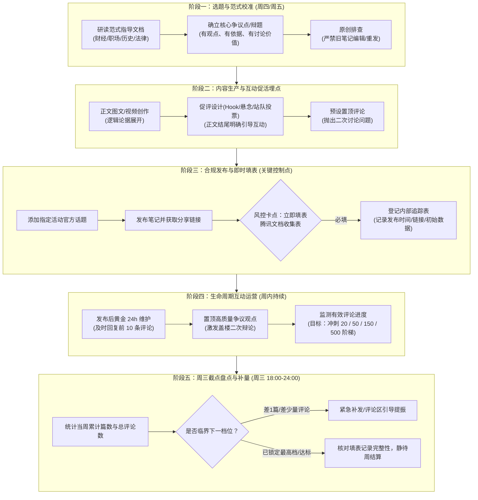

# 小红书创作活动运营与履约 SOP 工作流

> 本工作流专为小红书社群活动（内容范式与阶梯激励升级版）设计，覆盖**从选题策划、促评制作、质检发布，到即时填表、互动维护与周三冲榜复盘**的全周期闭环，旨在确保 100% 履约合规、防止漏填漏报，并最大化获取官方阶梯流量券与限定周边激励。

---

## 一、 活动关键规则与激励矩阵

### 1. 核心周期与基础门槛
* **活动总周期**：即日起至 **9 月 30 日**
* **每周统计周期**：**周四 00:00 至次周三 24:00**（以周为结算单位）
* **基础保底权益**：单篇符合新版内容范式的活动笔记，享受**最低 10 万流量扶持**保持不变。
* **重磅加持**：优质内容获“官薯翻牌”，享海量额外曝光。
* **规则变更警示**：原“单篇有效评论 ≥ 50 条额外获得 5 万流量”规则已废止，全面升级为**阶梯流量券 + 榜单奖**。

### 2. 激励阶梯速查表（1000 流量券机制）

> [!IMPORTANT]
> **只有按时在腾讯文档填表的笔记才会被记入！不填表 ＝ 白做！**

| 奖励等级 | 奖励名称 | 核心考核指标（双门槛必须同时满足） | 奖励额度 | 策略定位 |
| :--- | :--- | :--- | :--- | :--- |
| **新人专享** | **新人首发奖** | 历史从未提过有效稿 + 本周发布 **1 篇**合规新笔记 | **1 张**（1000流量券） | 破冰保底 |
| **基础参与** | **创作参与奖** | 当周发布 **2～4 篇** 且 累计有效评论 **≥ 20 条** | **1 张**（1000流量券） | 日常基线（适合轻量创作者） |
| **进阶持续** | **持续创作奖** | 当周发布 **5～9 篇** 且 累计有效评论 **≥ 50 条** | **2 张**（1000流量券） | 核心主力档（工作日日更1篇） |
| **高产共创** | **优质共创奖** | 当周发布 **≥ 10 篇** 且 累计有效评论 **≥ 150 条** | **3 张**（1000流量券） | 头部创作者/MCN冲榜档 |
| **单篇爆款** | **高热讨论奖** | **单篇**有效评论 **≥ 500 条**（无篇数限制） | **5 张**（1000流量券） | 争议话题/爆款专题冲刺 |
| **荣誉周边** | **活跃创作榜 TOP 3** | 当周有效活动笔记数量排名前 3 | **专属限定 T 恤**一件 | 产能第一梯队 |
| **荣誉周边** | **讨论热度榜 TOP 3** | 当周活动笔记有效评论总数排名前 3 | **专属限定 T 恤**一件 | 话题互动第一梯队 |

---

## 二、 全周期标准化执行工作流 (SOP)



---

## 三、 各阶段实操细则与落地要点

### 阶段一：选题与范式校准（每周四启动）
* **范式链接**：[新版创作指导说明](https://cowork.xiaohongshu.com/f/sr-8ffe0573/)
* **核心定位**：“围绕一个真正值得讨论的问题展开创作”。
* **赛道选题参考**：
  * **职场赛道**：非黑即白的职场选择题（例如：“35岁考公 vs 去外企带团队”、“职场中该不该做老好人”、“被边缘化后该反抗还是摸鱼”）。
  * **财经/消费**：具争议性的消费理念与投资现象（例如：“年轻人买黄金到底是理财还是交税”、“预制菜全面进商场你支持吗”）。
  * **法律/社会**：热门案例的法理与情理冲突（例如：“正当防卫的判定边界”、“夫妻共同财产与婚前协议争议”）。
  * **历史/人文**：人物翻案或历史决策的分歧点（例如：“某历史人物的抉择到底功大于过还是过大于功”）。
* **合规底线**：
  * 必须是新发布的原创笔记。**严禁修改历史笔记重新提交或二次发布旧内容**。

---

### 阶段二：内容制作与“促评埋点”设计（冲刺评论门槛核心）
因为各级流量券强依赖**“有效评论数”**（20 / 50 / 150 / 500 条），笔记结构必须自带**讨论引信**：

1. **正文结尾埋入明确的站队/提问勾子**：
   * ❌ *平淡收尾*：“以上就是我的看法，希望对大家有帮助。”（极难产生评论）
   * ✅ *互动收尾*：“如果是你遇到这种情况，你会选择A还是B？为什么？评论区聊聊。” / “大家觉得这个判例合理吗？你赞同哪种观点？”
2. **提前准备“置顶评论”（评论区第一枪）**：
   * 发布后 5 分钟内，作者亲自在评论区留下一条抛砖引玉、甚至轻度反直觉的设问，并将其置顶，降低读者的评论门槛。

---

### 阶段三：发布质检与“即时填表”防漏机制

> [!CAUTION]
> **填表生命线**：活动方明确声明“不填表 ＝ 未参与活动”。切勿留到周末或周三批量填，容易遗漏！

* **标准执行流程**：
  1. 检查标题与正文中是否已经挂载**官方指定的活动主话题**。
  2. 笔记点击发布，状态转为正常可见后，**立即点击“分享”->“复制链接”**。
  3. 打开官方收集表单：[活动笔记收集表](https://doc.weixin.qq.com/forms/ANAAyQcbAAgAbEAGAb_AKoCNPRTWz2o5f)。
  4. 完整填写真实小红书号、昵称、笔记链接、赛道垂类并提交。
  5. 截图表单提交成功页，或在团队内部表格打勾确认（“已填表”）。

---

### 阶段四：生命周期促评与互动（达成 20/50/150/500 条）
* **前 2 小时黄金回复法**：对前 5~10 条有实质内容的读者评论进行**启发式反问**（例如：“你的这个切入点很有意思，但如果考虑到XX因素，你还会这么选吗？”），通过一问一答让评论数翻倍，并带动其他读者加入围观。
* **高热单篇冲刺（目标 ≥ 500 条）**：
  * 挑选本周前 2 天内互动率最高、争议最激烈的一篇，集中资源推流或在社群引发讨论，全力争取 **5 张 1000 流量券**。

---

### 阶段五：周三临界点盘点与冲档策略（每周三 18:00 - 24:00）

每周三是官方统计周期的截止日（周三 24:00 截断）。在此之前开展**“阶梯查漏补缺”**：

```
当前处于 4 篇笔记，35 条评论？
👉 策略：只需在周三晚 21:00 前紧急产出并发布第 5 篇，并在前几篇中引导补足 15 条评论，即可从【创作参与奖(1张)】直接跃升为【持续创作奖(2张)】！
```

* **核算清单**：
  1. 检查当周笔记总篇数：是否刚好卡在 1篇、4篇、9篇 的临界点？差 1 篇能否加产？
  2. 检查当周有效评论总数：是否卡在 18条、45条、140条？通过作者精选回复拉满评论差额。
  3. 核实本周所有发布笔记是否全部完成了表单提报。

---

## 四、 实用协作与进度追踪模板

### 创作者周度执行与填表看板（建议制作为在线表格）

| 序号 | 发布日期 | 统计周期 | 笔记标题 | 垂类赛道 | 核心争议/讨论问题 | 正式链接 | 官方话题已挂 | 官方表单已提交 | 当前有效评论 | 目标奖项匹配 | 状态 |
| :---: | :---: | :---: | :---: | :---: | :---: | :---: | :---: | :---: | :---: | :---: | :---: |
| 1 | 09-10 | 第N周 | 例：35岁降薪去国企值不值 | 职场 | 职业稳定性vs薪资发展 | `http://...` | [x] 是 | [x] 已提交 | 65 | 持续创作/单篇冲刺 | 运营中 |
| 2 | 09-11 | 第N周 | 例：预制菜国标出台对谁有利 | 消费 | 工业化便利vs食品知情权 | `http://...` | [x] 是 | [x] 已提交 | 28 | 持续创作奖 | 运营中 |
| ... | ... | ... | ... | ... | ... | ... | [ ] 否 | [ ] 待提交 | ... | ... | 待发 |

---

## 五、 重点避坑与风控指南

1. **严禁二次翻新**：切勿将以往发过的数据不好的旧笔记改写标题重新发，官方后台可识别笔记ID与素材特征，一旦判定为非原创新稿，不仅无法获奖，还可能影响账号权重。
2. **严防“无效评论”**：表情符号刷屏、互赞互粉、“打卡/互关”等机器/低质评论极可能被系统过滤为无效评论。必须依靠真诚、有争议的内容引发实质性文字讨论。
3. **官薯翻牌抓手**：官方格外看重“排版美观、观点新颖、有实证或真实经历佐证、讨论氛围积极友善”的内容，遵循新版范式是获得官薯推荐的前提。
