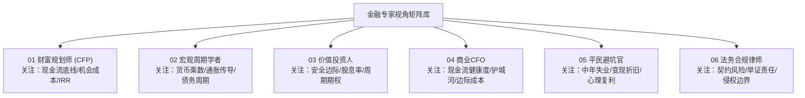

# 金融图文内容生产：多专家视角系统设计方案 (Expert Perspectives Framework)

> **设计核心**：单一维度的金融科普容易陷入“说教、平淡、片面”。通过**“多专家视角交锋矩阵（Multi-Expert Personas）”**，在同一个话题下引入不同立场的专家角色（宏观学者、精算规划师、价值投资人、商业CFO、平民避坑官、法务律师），**让专家之间产生观点的深度碰撞**，从而天然构建起“势均力敌、有理有据、极具张力”的爆款图文内容。

---

## 一、 6 大核心专家角色库 (Core Expert Personas)



| 标识符 | 专家视角名称 | 专业背景与底层逻辑 | 核心关切与审核口吻 | 适合支撑图文页面 |
| :--- | :--- | :--- | :--- | :--- |
| `cfp_planner` | **财富规划师与精算视角** | 注册理财规划师 (CFP)、精算师，精通家庭流动性、保险精算与IRR内部收益率。 | *“脱离流动性储备谈省利息，都是在拿家庭安全裸奔。”* 极度厌恶家庭现金流断裂风险。 | **P2 现实账本**<br>**P5 现金流动性立论** |
| `macro_economist` | **宏观经济与周期学者** | 宏观策略分析师，精通M2增速、通胀通缩传导、债务周期与美元潮汐。 | *“顺周期加杠杆是赌博，看懂央行资产负债表才是真正的降维生存。”* 习惯用30年大历史周期推导资产贬值。 | **P3 认知剪刀差**<br>**P5 债务稀释立论** |
| `value_investor` | **硬核价值投资人** | 私募基金经理，精通自由现金流折现 (DCF)、安全边际、估值分位数与博弈筹码。 | *“当防守资产被买成香饽饽，最大的安全就变成了最大的风险。”* 极度看重赔率与周期底部的抄底期权。 | **P4/P5 标的估值博弈**<br>**P6 站队选项** |
| `corporate_cfo` | **商业战略与CFO视角** | 上市公司资深财务总监，精通三张报表真伪、营运资本占用、供应链规模经济。 | *“账面净利润解决不了生存，谁能把沉没成本变成护城河谁才能活下来。”* 善于撕破繁荣假象看真假现金流。 | **04 商业公司拆解**<br>**财报真伪剖析** |
| `consumer_advocate` | **平民现实派与反收割官** | 财经资深媒体人，洞察中年职场焦虑、消费主义溢价、金店工费套路与情绪价值。 | *“普通人别被宏大词汇忽悠，先算算这笔买卖你变现时要被砍几刀。”* 极度务实，强调心理复利与无债一身轻。 | **P4 提前还贷立论**<br>**黄金避坑揭秘** |
| `legal_expert` | **法律合规与风控律师** | 资深民商法与劳动法律师，精通风控条款、劳资博弈、财产分割与侵权抗辩。 | *“金融的本质是契约，所有情理上的争议，最后都要落到法定责任与举证边界上。”* 极度严密，死守事实底线。 | **01 房贷合同违约**<br>**劳动法/侵权辩题** |

---

## 二、 话题与专家视角的动态路由规则 (Routing Matrix)

根据输入话题所属的图谱领域，系统自动选择 **2~3 位立场相互制衡的专家** 进入流水线：

```mermaid
flowchart LR
    Topic["输入话题: 提前还房贷"] --> Router{"动态专家路由"}
    Router -->|代表正方 (还贷)| E5["平民避坑官: 强调心理复利与降月供"]
    Router -->|代表反方 (留钱)| E1["财富规划师: 强调现金流呼吸机不可逆"]
    Router -->|提供剪刀差| E2["宏观经济学者: 算清30年债务通胀稀释账"]
    E5 & E1 & E2 --> Note["装配出势均力敌的标准 6 页图文"]
```

### 垂类路由对照表

1. **个人收支与房贷负债**：
   * **正方 (还贷派)**：`consumer_advocate`（平民避坑官：厌恶负债、锁定收益、心理减负）
   * **反方 (留钱派)**：`cfp_planner`（财富规划师：流动性不可逆、医疗备用金底线）
   * **剪刀差拆解**：`macro_economist`（宏观周期学者：30年通胀稀释与廉价杠杆价值）
2. **黄金、金豆与大宗资产**：
   * **正方 (抗通胀派)**：`macro_economist`（宏观学者：主权信用对冲、去美元化趋势）
   * **反方 (割韭菜派)**：`consumer_advocate`（平民避坑官：金店30%工艺溢价与回收折价陷阱）
   * **估值校验**：`value_investor`（价值投资人：实际利率倒挂与黄金长期复合回报率比照）
3. **红利资产与高股息股票 (如长江电力)**：
   * **正方 (避风港派)**：`cfp_planner`（规划师：类固收稳定现金流替代、老龄化低利率护城河）
   * **反方 (站岗陷阱派)**：`value_investor`（投资人：拥挤度过高、股息率被稀释、资本利得回撤风险）
   * **商业验证**：`corporate_cfo`（商业CFO：大坝折旧年限与自由现金流久期）
4. **宏观消费争议 (放假 vs 发钱)**：
   * **正方 (休假派)**：`consumer_advocate`（体验经济与闲暇时间替代效应）
   * **反方 (发钱派)**：`macro_economist`（边际消费倾向与收入效应乘数模型）

---

## 三、 专家视角如何具体注入 6 页图文装配流水线

在自动化生产脚本中，各页面根据专家角色分工定向赋能：

```
【P1 封面】──► 提炼两位专家的核心分歧对撞（如：锁定4%收益 vs 握紧救命现金）
     ↓
【P2 痛点】──► 由 CFP规划师 摆出真实利率差距（1.8%存单 vs 4.0%房贷）
     ↓
【P3 剪刀差】──► 由 宏观学者 揭示大众看不见的隐性代价（一生最长最廉价杠杆的丧失）
     ↓
【P4 正方】──► 由 平民避坑官 输出落袋为安派的 3 条生活化硬核立论
     ↓
【P5 反方】──► 由 投资人与规划师 输出周期抄底与抗风险的 3 条专业立论
     ↓
【P6 站队】──► 汇聚两派终极诉求，抛出势均力敌的 A/B 投票箱与二选一发问
```

通过这套专家视角机制，自动生成的每一页文案都带有**真实的专业行话与逻辑纵深**，彻底解决大模型生成内容“假大空、像学生作文”的顽疾！
