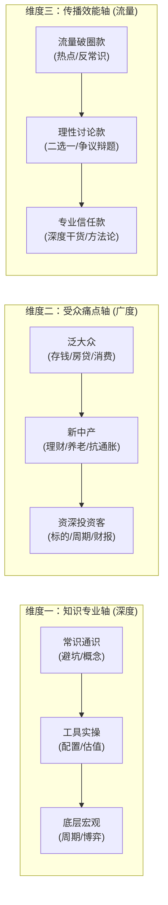
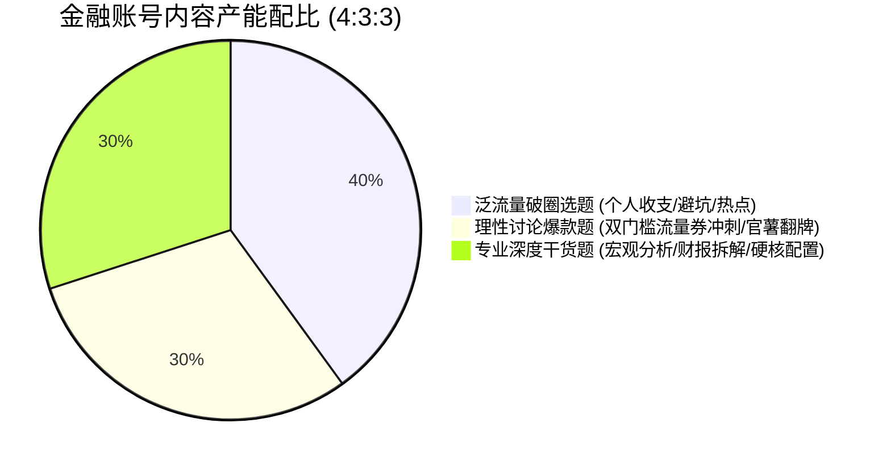

# 金融知识分享账号：三维立体知识图谱与话题体系全景规划

> **规划宗旨**：打破传统教材“照本宣科、枯燥晦涩”的死板结构，以**“用户认知痛点”为经线**，以**“底层金融逻辑”为纬线**，结合社交平台（尤其是小红书“理性讨论”范式）的传播规律，构建**易理解、高互动、强信任、好变现**的立体化金融话题图谱。

---

## 一、 顶层规划逻辑：从“传统分类”转向“内容图谱”

传统金融学划分（货币银行学、证券投资学、国际金融等）是为**考试教学**设计的，直接照搬到自媒体必死无疑。自媒体金融知识图谱必须建立在**“三维坐标系”**之上：



---

## 二、 金融知识全景图谱矩阵（6 大母模块 × 18 个子领域）

```mermaid
flowchart TD
    ROOT["金融知识图谱体系<br/>(Finance Knowledge Graph)"]

    %% L1 Modules
    ROOT --> M1["01 个人收支与底线风控<br/>(流量基石·大众刚需)"]
    ROOT --> M2["02 投资工具与资产配置<br/>(进阶黏性·财富实操)"]
    ROOT --> M3["03 宏观周期与货币密码<br/>(专业壁垒·降维认知)"]
    ROOT --> M4["04 商业洞察与公司财务<br/>(商业敏锐·信息差挖掘)"]
    ROOT --> M5["05 金融史鉴与危机复盘<br/>(长尾长青·故事与反思)"]
    ROOT --> M6["06 时代痛点与认知辩题<br/>(官方投流·爆款讨论)"]

    %% M1 Branches
    M1 --> M1_1["现金流与流动性管理"]
    M1 --> M1_2["负债艺术与信贷杠杆"]
    M1 --> M1_3["保险架构与反脆弱防御"]

    %% M2 Branches
    M2 --> M2_1["固收与低风险基本盘"]
    M2 --> M2_2["指数基金与权益投资"]
    M2 --> M2_3["黄金、大宗与另类资产"]

    %% M3 Branches
    M3 --> M3_1["央行印钞机与货币政策"]
    M3 --> M3_2["通胀、通缩与债务周期"]
    M3 --> M3_3["美元潮汐与汇率博弈"]

    %% M4 Branches
    M4 --> M4_1["三张财务报表的商业真伪"]
    M4 --> M4_2["商业模式与护城河解密"]
    M4 --> M4_3["资本运作、估值与IPO"]

    %% M5 Branches
    M5 --> M5_1["货币演变与金融制度起源"]
    M5 --> M5_2["经典泡沫与股灾启示录"]
    M5 --> M5_3["全球近代金融危机深度复盘"]

    %% M6 Branches
    M6 --> M6_1["消费主义解构与理性评估"]
    M6 --> M6_2["阶层跃迁与代际财富传承"]
    M6 --> M6_3["行业暴利争议与监管博弈"]
```



---

## 三、 各模块深度话题库与“理性讨论”选题规划

### 模块一：个人收支与底线风控 (Personal Cashflow & Protection)
> **受众心理**：恐惧贫穷、渴望避坑、关注切身利益。
> **内容属性**：高播放、高完播、泛流量入口。

| 子节点 | 核心金融逻辑 | 常规科普切口 | 小红书“理性讨论”爆款选题（带对立辩题） |
| :--- | :--- | :--- | :--- |
| **1.1 现金流与应急池** | 机会成本、流动性偏好、无风险收益率 | 怎么存够 6 个月应急备用金？ | 存款放在活钱理财 vs 定期存单，为了 1% 的息差损失流动性到底值不值？ |
| **1.2 负债与信贷杠杆** | 资金成本、内部收益率 (IRR)、负债杠杆 | 等额本金和等额本息有什么区别？ | **提前还房贷到底是锁定确定性收益，还是交出未来资产通胀期的话语权？** |
| **1.3 保险与底层防御** | 概率论、大数法则、精算净费率与消费型逻辑 | 年轻人第一张保单该怎么挑？ | 给孩子买返还型重疾险到底是“有病治病没病返钱”，还是给保险公司交沉没智商税？ |

---

### 模块二：投资工具与资产配置 (Investment Instruments & Asset Allocation)
> **受众心理**：希望钱生钱、寻找靠谱收益、对抗资产缩水。
> **内容属性**：高收藏、高关注、构建专业权威感。

| 子节点 | 核心金融逻辑 | 常规科普切口 | 小红书“理性讨论”爆款选题（带对立辩题） |
| :--- | :--- | :--- | :--- |
| **2.1 固收基本盘** | 净值化转型、信用利差、久期风险 | 什么是大额存单和同业存单？ | 银行理财破净已成常态，普通人该继续忍受低收益，还是承受波动买债基？ |
| **2.2 指数基金与权益** | 宽基ETF、高股息红利、微笑曲线与均值回归 | 定投沪深300还是中证500？ | **长江电力这种高股息资产逐渐涨高，现在入场是长期安全避风港还是高位站岗？** |
| **2.3 黄金与贵金属** | 信用货币信用对冲、实际利率与避险溢价 | 黄金价格受什么因素影响？ | **年轻人跟风攒金豆是明智储蓄，还是为溢价和变现折旧买单的伪理财？** |

---

### 模块三：宏观周期与货币密码 (Macro Economics & Monetary Dynamics)
> **受众心理**：大局观欲望、看懂时代趋势、降维理解财富分配。
> **内容属性**：高点赞、高转发、塑造高级知识 IP 形象。

| 子节点 | 核心金融逻辑 | 常规科普切口 | 小红书“理性讨论”爆款选题（带对立辩题） |
| :--- | :--- | :--- | :--- |
| **3.1 货币政策与央行** | M2增速、降准与降息的传导机制、货币乘数 | 央行降准到底降的是什么？ | 降息时代来临，钱从银行流向实体，普通人是该加杠杆买资产还是持币现金为王？ |
| **3.2 通胀与债务周期** | 费雪债务通缩理论、流动性陷阱、CPI与PPI剪刀差 | 什么是滞胀？有什么危害？ | **拉动消费到底靠“休假时间多”更有效，还是靠“工资收入多”更根本？** *(官方指导案例)* |
| **3.3 美元潮汐与汇率** | 三元悖论、利差交易 (Carry Trade)、资本流动 | 美联储为什么总是加息降息？ | 美联储降息周期开启，人民币汇率升值对出口企业和普通海淘族谁更有利？ |

---

### 模块四：商业洞察与公司财务 (Corporate Finance & Business Models)
> **受众心理**：破解商业套路、寻找职场与创业底层认知、看懂上市公司财报。
> **内容属性**：高完播、高私信互动、吸引高客单精准用户。

| 子节点 | 核心金融逻辑 | 常规科普切口 | 小红书“理性讨论”爆款选题（带对立辩题） |
| :--- | :--- | :--- | :--- |
| **4.1 三张财务报表** | 营运资本、自由现金流、权责发生制与收付实现制 | 怎么一眼看出一家公司是不是皮包公司？ | 账面利润几千万却发不出工资，是企业高速扩张的必然代价还是财务崩盘的前兆？ |
| **4.2 商业模式护城河** | 轻重资产转换、边际成本递减、沉没成本与转换壁垒 | 为什么茅台的毛利率高达90%？ | **预制菜全面进驻连锁餐饮，究竟是现代工业化降本的进步，还是侵害知情权的牟利？** |
| **4.3 资本运作与商业战** | 股权稀释、DCF折现模型、反垄断与烧钱圈地 | 独角兽企业是怎么估值的？ | **星链正式宣战美国三大运营商，商业航天卫星到底能实现万亿暴利还是基站吞金兽？** |

---

### 模块五：金融史鉴与危机复盘 (Financial History & Economic Crises)
> **受众心理**：吃瓜求知、历史兴衰故事感、以史为鉴。
> **内容属性**：长生命周期长尾流量、完播率极高、适合视频化演绎。

| 子节点 | 核心金融逻辑 | 常规科普切口 | 小红书“理性讨论”爆款选题（带对立辩题） |
| :--- | :--- | :--- | :--- |
| **5.1 货币演变与制度** | 铸币税、纸币信用抵押、格雷欣法则（劣币驱逐良币）| 中国古代最早的纸币是什么？ | **同为古代纸币，明代大明宝钞为何比北宋前期的交子贬值得快得多？** *(官方指导案例)* |
| **5.2 经典泡沫启示录** | 投机狂热、明斯基时刻、杠杆清算连环踩踏 | 荷兰郁金香狂热是怎么回事？ | 郁金香狂热到底是一场全社会集体失智的泡沫，还是后世历史书夸大的轶事？ |
| **5.3 近代全球危机** | 次贷衍生品 (CDO/CDS)、流动性冻结、最后贷款人 | 2008年次贷危机为什么会波及全球？ | 雷曼兄弟破产时，美联储到底该坚持市场纪律任其倒闭，还是该不惜代价动用纳税人的钱救援？ |

---

### 模块六：时代痛点与认知辩题 (Contemporary Financial Philosophy)
> **受众心理**：站队争鸣、阶层情绪、价值观碰撞。
> **内容属性**：**社群评论爆炸款**、100% 贴合小红书官方“理性讨论”推荐机制。

| 子节点 | 核心金融逻辑 | 核心冲突轴 | 小红书“理性讨论”爆款选题（带对立辩题） |
| :--- | :--- | :--- | :--- |
| **6.1 消费主义与溢价** | 边际效用、凡勃伦效应、身份认同成本 | 实用价值 vs 体验与社交溢价 | **为品牌溢价和身份认同买单，到底算不算被消费主义洗脑的不理性消费？** *(官方案例)* |
| **6.2 阶层与资产沉浮** | 财富复利效应、阶层流动壁垒、代际资产转移 | 个人奋斗 vs 资本沉淀与时代红利 | 普通人跨越财富门槛，主要是靠个人极致努力省吃俭用，还是靠押中一次关键资产周期？ |
| **6.3 劳动与资本博弈** | 劳动力边际产出、劳动法合规成本、资方收益率 | 劳动者保护 vs 中小企业生存底线 | **劳动法严格执行是保障劳动者基本尊严，还是可能反向加速中小企业倒闭减少就业？** |

---

## 四、 知识图谱内部的因果网状拓扑关系 (Interconnected Topology)

优质金融账号的魅力在于：**每一个微观生活问题，背后都有宏观变量在支撑；每一个宏观新闻，都能推导到个人的钱包。**

```
【宏观变量】美联储降息 / 国内央行降准
     │
     ├─►【传导通道 A】市场流动性增加 ──► 银行存款利率走低 ──► 居民资产何处安放？
     │                                                     ├─► 辩题 1：该不该买年金险锁死 3%？
     │                                                     └─► 辩题 2：该不该提前把 4.2% 的房贷还掉？
     │
     ├─►【传导通道 B】大宗商品计价变动 ──► 国际金价波动 ──► 国内金店足金饰品大涨
     │                                                     └─► 辩题 3：买实物金条是增值避险还是交加工费？
     │
     └─►【传导通道 C】实体企业融资成本下降 ──► 上市公司盈利改善 ──► 红利资产股息率重估
                                                           └─► 辩题 4：高分红股票是不是无风险“债券替代品”？
```

---

## 五、 内容运营排期与资产矩阵落地法则

为保证账号既有“源源不断的新流量”，又有“持续深度的专业信任”，建议执行 **4 : 3 : 3** 黄金发布比例：



1. **40% 泛流量破圈笔记（周一、周四发布）**：
   * 形式：大字报极简封面 ＋ 6张清晰图文。
   * 目标：拉高阅读量、打破冷启动，获取基础 10w+ 曝光。
2. **30% 理性讨论高热辩题（周五、周六发布）**：
   * 形式：对立站队大字报 ＋ 正反双方有力论据陈述 ＋ 结尾明确二选一 ＋ 黄金首评置顶。
   * 目标：全力冲刺 **单篇 500 条高热评论奖**（拿满 5 张 1000 流量券）及进入 **讨论热度榜 Top 3**。
3. **30% 专业深度长图文（周日、周二发布）**：
   * 形式：图表拆解、历史复盘、硬核数据走势。
   * 目标：引发深度收藏，建立专业金融专家人设，筛选高净值核心粉丝。
