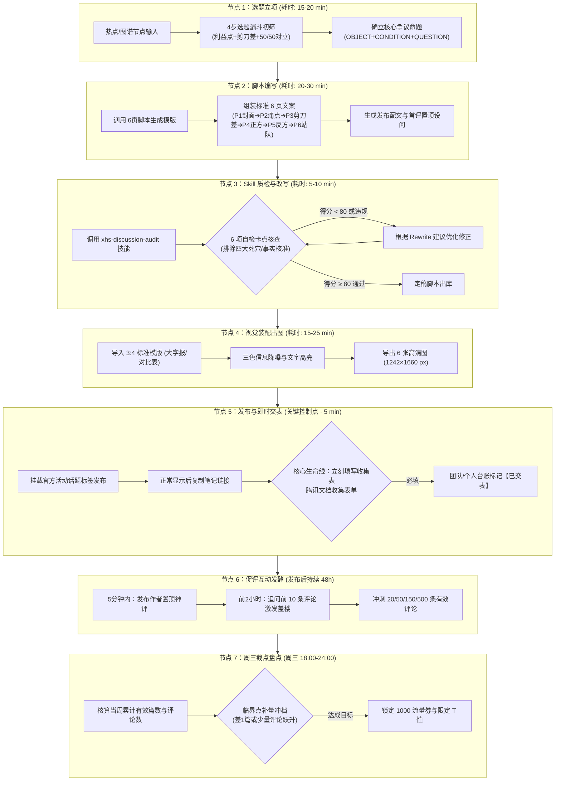

# 金融知识图谱图文笔记：工业化生产全流程工作流 (SOP)

> 本工作流将**选题推导逻辑、6页结构法、`xhs-discussion-audit` 质检技能与官方活动履约**整合为一条无缝衔接的“内容生产工业流水线”，支持单人创作者高效运转或团队标准化协同。

---

## 一、 全流程工作流全景图 (Workflow Architecture)



---

## 二、 各阶段详细实操规范与作业指导 (SOP)

### 节点 1：选题立项与剪刀差挖掘（每周一、周四上午集中推进）
* **责任人**：内容主编 / 创作者
* **输入源**：
  1. 金融知识图谱规划库（如：01个人负债、02黄金大宗、03货币政策等）；
  2. 当日全网财经热点与政策公告。
* **准则自检**：
  * 该选题是否挂钩大众的“资产、负债、收入、支出”？
  * 是否存在“大众以为”与“底层机制”的**认知剪刀差**？
  * 正反两方是否各有**极其充分的理由（50/50 势均力敌）**？

---

### 节点 2：6页标准脚本工业化编写（模板化产出）
* **输出规范**：
  * **P1 封面**：大字报风格，问题字号最大，红蓝对比色框标明核心矛盾。
  * **P2 现实痛点**：摆出真实数字算账对比（如利息差额、金价溢价）。
  * **P3 认知剪刀差**：揭示隐性代价（如“交出长期低息杠杆”）。
  * **P4 立场 A**：列出 3 条硬核立论。
  * **P5 立场 B**：列出 3 条硬核对立立论。
  * **P6 终极设问**：给出 A/B 两个明确选项，要求评论区站队。

---

### 节点 3：调用 `xhs-discussion-audit` 自动化质检（一票否决卡点）
* **执行动作**：
  * 在终端或对话框中运行质检，逐项核验 6 项卡点：
    1. `check_1`：标题本身是疑问句？
    2. `check_2`：存在至少两种站得住脚的答案？
    3. `check_3`：事实部分准确无伪造？
    4. `check_4`：包含具体对象与取舍条件？
    5. `check_5`：彻底排除了**个人流水账、教程攻略、励志鸡汤、纯生活态度**四大死穴？
    6. `check_6`：准备好即时填表？
* **放行标准**：评分 $\ge 80$ 分方可进入视觉设计。

---

### 节点 4：视觉装配与信息降噪（设计工序）
* **视觉参数底线**：
  * 尺寸：`1242 × 1660 px` (比例 3:4)。
  * 字体：主标粗黑体，正文无衬线字体。
  * 字数：单页严格控制在 80~120 字，避免大段阅读疲劳。
  * 对比表格与加粗：数字一律加粗，核心争议关键词标红。

---

### 节点 5：合规发布与即时填表（全流程最核心风控）
* **发布检查清单**：
  * [ ] 封面大字报是否被小红书安全区遮挡？
  * [ ] 正文末尾是否挂载官方指定活动话题标签？
  * [ ] **【生命线】** 笔记发布转为正常状态后，**立刻点击“分享”->“复制链接”**。
  * [ ] 打开官方收集表单：[活动笔记收集表](https://doc.weixin.qq.com/forms/ANAAyQcbAAgAbEAGAb_AKoCNPRTWz2o5f) 完成提交。
  * [ ] 在内部排期表登记并勾选“已交表”（**不填表＝未参与活动，白费功夫**）。

---

### 节点 6：促评互动发酵（前 48 小时流量放大）
* **发布后 5 分钟**：
  * 作者本人发布预先写好的**置顶神评**，给出一个中立折中视角，直接降低读者的第一条评论门槛。
* **发布后 2 小时（黄金促评期）**：
  * 对前 10 条读者实质性评论做**启发式追问**（例如：“你的这个切入点很有代表性，但如果考虑到家庭失业风险，你还会这么选吗？”），引发楼中楼激烈二次辩论。
* **目标跟踪**：
  * 周内持续监控单篇有效评论，全力推进跨越 20 条、50 条、150 条及 500 条大奖门槛。

---

### 节点 7：周三截点冲档盘点（每周三 18:00 - 24:00）
* **核算差距与冲档动作**：
  * 检查当周已填表合格笔记篇数：
    * 若为 4 篇 $\rightarrow$ 距离【持续创作奖(2张券)】差 1 篇，周三晚 21:00 前紧急加更 1 篇快讯图文并立刻填表。
    * 若为 9 篇 $\rightarrow$ 距离【优质共创奖(3张券)】差 1 篇，立刻补发冲满 10 篇。
  * 检查当周累计有效评论总数：
    * 若卡在 18 条、46 条、140 条 $\rightarrow$ 作者在评论区集中回复与设问互动，补足差额，确保踏入更高一档流量奖励！

---

## 三、 自动化配套工具集：一键生成 Prompt 指令集

你可以直接复制以下 3 套标准化 Prompt，在日常制作中让 AI 协助快速产出：

### 1. 【选题挖掘与剪刀差生成 Prompt】
```text
请作为小红书爆款金融内容策划专家，基于以下金融知识点或新闻：
【输入你的金融概念或热点新闻】

请按照“利益锚定 + 认知剪刀差 + 50/50双边对辩”模型，推导出 3 个符合小红书官方“理性讨论”范式的爆款议题，必须包含：
1. 目标受众切肤利益点（房/金/车/负债/开销）
2. 认知剪刀差（大众直觉 vs 底层金融真相）
3. 正反双方势均力敌的论据天平（立场A理由 vs 立场B理由）
4. 组装后的官方四要素标题（OBJECT+CONDITION+QUESTION+INVITATION）
```

### 2. 【6页标准图文脚本装配 Prompt】
```text
请根据以下金融讨论议题：
【输入确立的辩题标题】

按照“6页标准图文结构法”输出直接用于排版的完整脚本：
- P1 封面：大字报文案设计（主标 + 核心矛盾副标 + 标签）
- P2 痛点切入：列出显性账本对比（具体数字表格）
- P3 认知剪刀差：揭示大众看不见的隐形代价与长远损失
- P4 辩方立场 A：列出 3 条硬核、充分且不可反驳的立论
- P5 辩方立场 B：列出 3 条抗风险、反周期的硬核立论
- P6 结尾与促评：提炼 A/B 两大站队立场，设计直击灵魂的二选一站队引导提问
- 附：小红书发布正文配文（含Hashtag） + 作者前5分钟置顶神评设计
```

### 3. 【`xhs-discussion-audit` 自动化质检指令】
```text
请调用 xhs-discussion-audit 技能，对上述生成的标题与 6 页脚本进行全面体检：
1. 逐条判定官方六大自检卡点（[PASS] 或 [FAIL]）；
2. 严格排查个人流水账、方法教学、励志鸡汤、纯消费态度四大死穴；
3. 核查事实部分是否准确无虚构前提；
4. 给出 0-100 分量化评分与最终投流判定结论。
```
