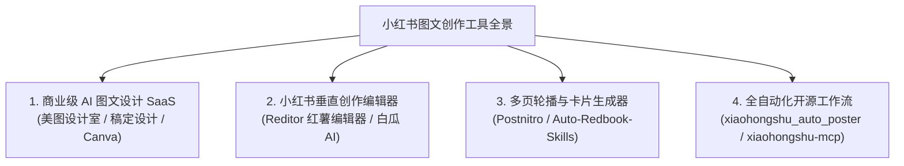

# 小红书 AI 图文自动化生成竞品全景分析报告

> **文档定位**：全网小红书图文内容生产、AI 卡片生成与自动化发布工具深度调研与竞品分析  
> **生成时间**：2026-09-10  
> **归档路径**：`prds/competitor_analysis_report.md`  
> **适用对象**：产品经理、项目维护者、内容运营策略团队与技术开发者  

---

## 目录

1. [竞品市场格局概览](#一-竞品市场格局概览)
2. [商业级 AI 图文与设计 SaaS 竞品](#二-商业级-ai-图文与设计-saas-竞品)
3. [GitHub 开源生态核心竞品项目](#三-github-开源生态核心竞品项目)
4. [核心对比矩阵 (本项目 vs 四大竞品派系)](#四-核心对比矩阵-本项目-vs-四大竞品派系)
5. [本项目的核心护城河与“偷师”借鉴路线](#五-本项目的核心护城河与偷师借鉴路线)

---

## 一、 竞品市场格局概览

当前全网专注于“小红书图文自动化/半自动化生产”的产品主要划分为 **4 大主流派系**：

---

## 二、 商业级 AI 图文与设计 SaaS 竞品

### 1. 美图设计室 (DesignKit) · 小红书专精版
* **产品官网**：[https://www.designkit.com](https://www.designkit.com) | [美图秀秀官网入口](https://xiuxiu.meitu.com/)
* **功能定位**：美图旗下专攻电商营销、自媒体配图的 AI 设计套件，深度接入 DeepSeek 等大模型。
* **核心功能**：
  * **AI 图文一键生成**：输入一句话主题，自动拆解文案大纲，秒级生成 3:4 比例的封面海报与内页轮播图；
  * **小红书主流视觉适配**：支持奶油风、极简高级风、手绘风、复古杂志风等数十套调色模版；
  * **电商修图增强**：支持一键抠图、换模特、画质超分与营销标签自动对齐。
* **优势**：视觉工业级审美极高，模板丰富，完全符合小红书年轻女性主流群体的视觉喜好。
* **劣势**：高度侧重于美妆、穿搭、美食与电商带货；**完全缺乏深度财经、理性讨论与硬核算账逻辑支持**。

---

### 2. 稿定设计 (Gaoding AI)
* **产品官网**：[https://www.gaoding.com](https://www.gaoding.com)
* **功能定位**：主打商业营销设计与智能体批量生产的工作流平台。
* **核心功能**：
  * **稿定 AI 营销智能体**：支持输入产品核心卖点，批量跑出成套的小红书多图；
  * **爆款主图复刻**：支持上传对标账号爆款主图，自动提取版式结构并进行“同款排版仿写”；
  * **多 SKU 批量渲染**：支持一人管理多个矩阵账号的物料并发输出。
* **优势**：批量化吞吐量大，商业转化海报组件齐全。
* **劣势**：商业广告属性过强，产出的图文带有明显的“电商营销号”痕迹，不符合“理性讨论”长尾信任逻辑。

---

### 3. Reditor (红薯编辑器) / 白瓜 AI
* **产品官网**：[https://reditor.cn](https://reditor.cn) | [白瓜 AI 创作平台](https://www.baigua.ai/)
* **功能定位**：专为小红书博主定制的图文与排版辅助工具。
* **核心功能**：
  * **违禁词与敏感词检测**：实时对比小红书平台违禁词库，标红提示降权词汇；
  * **小红书 Emoji 智能排版**：一键将枯燥段落重排为带小红书特色 Emoji、分段空行的网感文本；
  * **爆款标题库与灵感挖掘**：提供大量“三段式”、“反问二选一”标题模版。
* **优势**：对小红书平台的文本风控规则和语言风格吃得最透。
* **劣势**：偏向“文字编辑辅助”，图片渲染通常只是简单的纯色单图，缺乏连环卡片叙事张力。

---

### 4. Postnitro (海外卡片轮播图标杆)
* **产品官网**：[https://postnitro.ai](https://postnitro.ai)
* **功能定位**：全球领先的 AI 社交卡片轮播图（Carousel Generator）工具。
* **核心功能**：
  * 将长博客、PDF、文章一键提取出 5~8 页带有高信息密度的滑动卡片；
  * 具备“封面痛点 ➔ 剪刀差 ➔ 正反立论 ➔ 结尾互动”的标准节奏模板。
* **优势**：版式节奏感一流，支持快速切换手绘涂鸦风、极简风、黑客风等主题。
* **劣势**：面向 LinkedIn / Instagram / X 平台，未做国内小红书平台的合规审查与履约适配。

---

## 三、 GitHub 开源生态核心竞品项目

### 1. Auto-Redbook-Skills (小红书卡片排版神器)
* **开源仓库**：[GitHub - comeonzhj/Auto-Redbook-Skills](https://github.com/comeonzhj/Auto-Redbook-Skills)
* **技术亮点**：
  * 内置 **8 套专属主题皮肤**（牛皮纸底纹、科技感深色、便签纸、网格风等）；
  * 内置 **4 种自动分页切片模式**，能根据文本段落高度动态拆分为多张 3:4 比例卡片；
  * 专门解决“卡片内容太长如何优雅分页”的工程痛点。
* **借鉴价值**：其卡片皮肤与自适应高度分页算法，可直接作为我们去除“AI味/纯白死板感”的代码参考。

---

### 2. xiaohongshu_auto_poster (全闭环自动化发布)
* **开源仓库**：[GitHub - asiyoua/xiaohongshu_auto_poster](https://github.com/asiyoua/xiaohongshu_auto_poster)
* **技术亮点**：
  * 实现了“大纲提取 ➔ AI 生图 ➔ Playwright 自动化扫码发布”的端到端无人值守链路；
  * 引入了**拟人化操作机制**（随机鼠标滑动轨迹、动态延时、Cookie 会话保持），极大降低了封号风控概率。
* **借鉴价值**：为我们后续开发“一键自动导出 PNG 并发布到小红书”提供了成熟的 Playwright 范式。

---

### 3. Xiaohongshu-Content-Generator (博客转小红书图文)
* **开源仓库**：[GitHub - shaozheng0503/Xiaohongshu-Content-Generator](https://github.com/shaozheng0503/Xiaohongshu-Content-Generator)
* **技术亮点**：
  * 输入任意 Markdown 技术文档或博客，LLM 自动提炼核心卖点金句，输出结构化图文卡片。

---

### 4. xiaohongshu-mcp (基于 MCP 协议的智能体工作流)
* **开源仓库**：[GitHub - xpzouying/xiaohongshu-mcp](https://github.com/xpzouying/xiaohongshu-mcp)
* **技术亮点**：
  * 采用模型上下文协议（Model Context Protocol, MCP），支持与 Claude / Antigravity 等 AI IDE 或 Agent 框架无缝挂载。

---

## 四、 核心对比矩阵 (本项目 vs 四大竞品派系)

| 核心评估维度 | 美图设计室 / 稿定设计 (商业SaaS) | Reditor / 白瓜 AI (编辑辅助) | Auto-Redbook-Skills (开源排版) | **本项目 (tuwengongzuoliu)** |
| :--- | :--- | :--- | :--- | :--- |
| **底层核心逻辑** | 电商种草 / 海报视觉 | 敏感词检测 / 文本排版 | 文本高度切片与渲染 | **三维金融逻辑 + 深度理性辩论** |
| **官方活动与投流对齐** | ❌ 无 (不关心平台活动) | ⚠️ 仅有违禁词检测 | ❌ 无 | ✅ **内置 6 项卡点质检 (一票否决4大死穴)** |
| **立论深度与角色** | ❌ 单一口吻 | ❌ 单一口吻 | ❌ 单一口吻 | ✅ **6大专家交锋矩阵 (CFP vs 反收割官)** |
| **量化数据与算账能力** | ❌ 无真实算账公式 | ❌ 无 | ❌ 无 | ✅ **内置精算数学引擎 (利差/溢价率/Runway)** |
| **真实案例与中产切片** | ❌ 仅有商业假图 | ❌ 无 | ❌ 无 | ✅ **内置真人案例数据库 (`case_library.json`)** |
| **视觉呈现成熟度** | ⭐️⭐️⭐️⭐️⭐️ (商业极品) | ⭐️⭐️ (纯文本图) | ⭐️⭐️⭐️⭐️ (8套精选皮肤) | ⭐️⭐️⭐️ (代码清晰，但需优化去AI味) |
| **履约与中台营销支持** | ❌ 无 | ❌ 无 | ❌ 无 | ✅ **自动生成置顶神评 + 中台活动配置** |

---

## 五、 本项目的核心护城河与“偷师”借鉴路线

### 5.1 我们的不可替代性（护城河）
1. **深度懂小红书官方扶持规则**：绝大多数工具只懂“做图”，不懂小红书官方单篇 10万~20万 的“理性讨论”投流标准，容易产生被官方算法判定为“流水账/鸡汤/教程”的无效废稿。
2. **硬核数据与专家阵营支持**：我们拥有真正的 Python 精算模型与多专家对决机制，这是任何泛用型绘图工具所完全不具备的高门槛资产。

### 5.2 我们的“偷师”演进建议（取长补短）
1. **吸收 [Auto-Redbook-Skills](https://github.com/comeonzhj/Auto-Redbook-Skills) 的皮肤设计**：
   * 将其备忘录横线底纹、网格牛皮纸质感与荧光标记笔样式引入我们的 `render_html_card()`，彻底铲除 Tailwind 纯白塑料感。
2. **吸收 [Postnitro](https://postnitro.ai) 的封面大字报张力**：
   * 将 P1 封面升级为占据画幅 65% 的超大字报构图，增强信息流中的点击率。
3. **吸收 [xiaohongshu_auto_poster](https://github.com/asiyoua/xiaohongshu_auto_poster) 的无头浏览器导出**：
   * 集成轻量 Playwright 模块，一键直接将 HTML 渲染导出为 `1080×1440` PNG 高清图，实现真正的“免截图交付”。
