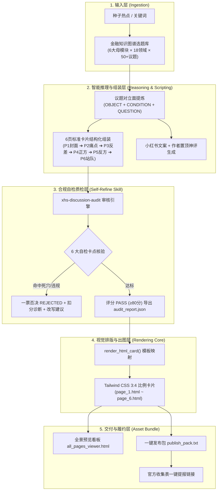

# tuwengongzuoliu (图文工作流) 项目深度分析报告

> **文档定位**：小红书图文内容工业化全自动生产工作流体系架构与工程分析  
> **生成时间**：2026-09-10  
> **状态版本**：v1.1 (深度诊断与架构分析版)  
> **适用对象**：项目维护者、内容运营团队、架构师与全栈开发者  

---

## 目录

1. [项目定位与商业背景](#一-项目定位与商业背景)
2. [系统整体架构与拓扑](#二-系统整体架构与拓扑)
3. [核心目录与代码模块剖析](#三-核心目录与代码模块剖析)
4. [标准 6 页图文结构法详解](#四-标准-6-页图文结构法详解)
5. [专属质检 Agent Skill 深度机制](#五-专属质检-agent-skill-深度机制)
6. [交互式前端工具集与本地服务](#六-交互式前端工具集与本地服务)
7. [当前工程成熟度与现状评估 (客观诊断)](#七-当前工程成熟度与现状评估-客观诊断)
8. [后续演进建议与实施路线规划](#八-后续演进建议与实施路线规划)

---

## 一、 项目定位与商业背景

### 1.1 项目定位
`tuwengongzuoliu` 是一个**面向小红书平台、以“理性讨论”官方扶持活动为核心的图文内容工业化与全自动生产系统**。  
系统旨在打通：**“种子辩题输入 ➔ 6页标准化脚本组装 ➔ 官方范式合规质检 ➔ 3:4 高清大字报卡片渲染 ➔ 发布物料打包与防漏交表”** 的端到端闭环。

### 1.2 商业与活动背景
* **官方活动**：小红书「理性讨论」官方创作激励活动。
* **流量扶持**：单篇符合新版内容范式即可享受 **10万 ～ 20万 官方曝光扶持**。
* **阶梯激励机制**：
  * **新人首发奖**：1 篇合规新笔记 ➔ 1 张 1000 流量券；
  * **创作参与奖**：当周 2~4 篇 且 有效评论 ≥ 20 ➔ 1 张 1000 流量券；
  * **持续创作奖**：当周 5~9 篇 且 有效评论 ≥ 50 ➔ 2 张 1000 流量券；
  * **优质共创奖**：当周 ≥ 10 篇 且 有效评论 ≥ 150 ➔ 3 张 1000 流量券；
  * **高热讨论奖**：单篇有效评论 ≥ 500 ➔ 5 张 1000 流量券；
  * **双榜 TOP 3**：活跃创作榜 / 讨论热度榜前 3 名 ➔ 活动专属限定 T 恤。
* **关键风控生命线**：发布后必须即时将笔记链接提交至官方腾讯文档收集表，**不填表视为未参与**。

---

## 二、 系统整体架构与拓扑

项目基于**数据驱动 + 规则质检 + 轻量前端渲染**的解耦设计，无需复杂的微服务或外部重量级编译框架：



---

## 三、 核心目录与代码模块剖析

### 3.1 项目完整目录速览

```text
tuwengongzuoliu/
├── docs/                                          # 4 份核心战略与 SOP 文档
│   ├── campaign_workflow_sop.md                   # 官方活动全周期运营与履约 SOP
│   ├── finance_knowledge_graph_planning.md        # 三维金融知识图谱与50+选题规划
│   ├── finance_note_production_workflow.md        # 金融图文工业化生产全流程工作流
│   └── automated_image_text_workflow_architecture.md # 全自动化技术架构与数据规范
├── pipeline/
│   └── auto_generate_note.py                      # 核心自动化调度流水线脚本 (360行)
├── skills/
│   └── xhs-discussion-audit/                      # 官方合规自检与改写 Skill 引擎
│       ├── SKILL.md                               # Agent 技能规范与判定树
│       ├── rules.json                             # 审核规则配置 (死穴特征词、5大垂类)
│       └── scripts/
│           └── audit_note.py                      # 独立合规体检打分脚本 (166行)
├── templates/                                     # 3 款交互式单页工具 (Tailwind CDN)
│   ├── pipeline_controller.html                   # 全自动化流水线交互控制器
│   ├── incentive_calculator.html                  # 活动收益测算与冲档助手
│   └── finance_graph_explorer.html                # 金融知识图谱与话题罗盘
├── examples/
│   └── mortgage_vs_invest/                        # 实测完整交付物案例 (提前还贷 vs 理财)
│       ├── page_1.html ~ page_6.html              # 标准 3:4 独立卡片 (HTML+Tailwind)
│       ├── all_pages_viewer.html                  # 6 卡片全景预览与文案看板
│       ├── audit_report.json                      # 自动化体检 100 分达标报告
│       └── publish_pack.txt                       # 发布文案包 (含置顶神评及表单链接)
├── prds/                                          # 规划文档与设计分析归档
├── start_viewer.ps1 / .bat                        # 本地轻量预览服务一键启动脚本 (端口 8765)
├── stop_server.ps1 / .bat                         # 预览服务关闭脚本
└── README.md                                      # 项目主说明文档
```

---

### 3.2 关键脚本功能拆解

#### 1. 流水线主控制器：[`pipeline/auto_generate_note.py`](file:///D:/cadabra_tools003/AgentPro/tuwengongzuoliu/pipeline/auto_generate_note.py)
* **入口函数**：`run_pipeline(topic, category, output_dir)`
* **核心职责**：
  * 接收命令行参数：`--topic`、`--category`、`--output`。
  * 动态引入 `skills/xhs-discussion-audit/scripts/audit_note.py` 中的 `audit_note()` 方法。
  * 组装包含 6 页卡片数据的字典对象。
  * 调用 `render_html_card()` 逐页生成基于 Tailwind CSS 的 3:4 比例独立网页。
  * 输出 `publish_pack.txt`（包含标题、正文、Hashtag、置顶神评、官方收集表链接）。
  * 组装 `all_pages_viewer.html`，通过 `iframe` 网格并排呈现 6 张卡片并集成一键复制文本框。

#### 2. 合规质检引擎：[`skills/xhs-discussion-audit/scripts/audit_note.py`](file:///D:/cadabra_tools003/AgentPro/tuwengongzuoliu/skills/xhs-discussion-audit/scripts/audit_note.py)
* **入口函数**：`audit_note(title, content, category)`
* **质检机制**：
  * **标题设问检测**：匹配 `?`、`吗`、`为什么`、`哪个`、`是否` 等关键字，非设问扣 25 分；
  * **空泛提问检测**：拦截“大家怎么看/你怎么看”，扣 15 分；
  * **死穴命中检测**：正则扫描个人流水账、方法教程、励志鸡汤、生活态度，命中一票否决扣 40 分；
  * **限定条件检测**：检查是否有比较对象与限制前提，缺少扣 15 分；
  * **多元对立检测**：核查是否存在正反两方的争议空间，缺少扣 10 分；
  * **综合裁定输出**：生成 0~100 分量化评分，产出 `PASS` / `NEEDS_OPTIMIZATION` / `REJECTED` 三级状态与改写建议。

---

## 四、 标准 6 页图文结构法详解

系统严格落实了针对小红书信息流阅读习惯的标准 6 页卡片法：

| 页码 | 卡片类型 (`type`) | 视觉与内容定位 | 关键技术字段 | 核心心理学机制 |
| :--- | :--- | :--- | :--- | :--- |
| **P1** | `cover_poster` | **大字报封面**：大字居中排版、红蓝两极对比背景框 | `title_main`, `subtitle`, `badge` | 黄金 1 秒直击痛点，提高信息流点击率 (CTR) |
| **P2** | `pain_point` | **痛点账本**：用具体数字呈现现实利益冲突（表格对标） | `heading`, `table_data`, `hook_question` | 具象化财务数据，激发读者焦虑与好奇心 |
| **P3** | `contrast_gap` | **认知剪刀差**：看得见的算计 vs 看不见的代价 | `visible_gain`, `hidden_cost`, `core_friction` | 击碎常识盲区，提供反直觉的高价值信息增量 |
| **P4** | `side_a` | **正方立场**：立场 A 的 3 条不可反驳的硬核立论 | `stance`, `arguments` (Array) | 为立场 A 提供弹药，激发正方阵营共鸣 |
| **P5** | `side_b` | **反方立场**：立场 B 的 3 条反周期、抗风险立论 | `stance`, `arguments` (Array) | 为立场 B 提供论据，制造 50/50 均衡对撞 |
| **P6** | `ending_hook` | **终极站队**：A/B 投票箱，直击灵魂二选一促评 Hook | `option_a`, `option_b`, `debate_invitation` | 降低发言门槛，引导读者在评论区站队盖楼 (促评) |

---

## 五、 专属质检 Agent Skill 深度机制

技能严格对标小红书官方新版创作指导标准，设置了四大投流死穴与六项自检卡点：

### 5.1 四大投流死穴（一票否决）
官方算法与人工审核严打以下 4 种类型，一经命中不予流量倾斜：
1. **个人流水账 (`personal_experience`)**：如“我的求职记录”、“今天面试复盘”、“打卡第15天”。
2. **方法教学/教程 (`tutorial_teaching`)**：如“保姆级避坑指南”、“手把手教学”、“干货拿走不谢”。
3. **励志鸡汤/感悟 (`motivational_summary`)**：如“狠狠搞钱”、“这几句话送给大家”、“终于想通了”。
4. **主观生活态度 (`lifestyle_attitude`)**：如“我的极简生活”、“松弛感”、“沉浸式开箱”。

### 5.2 核心议题公式
合规的高讨论度议题必须满足四大要素：
$$\text{优质议题} = \text{具体对象 (OBJECT)} + \text{明确条件 (CONDITION)} + \text{开放设问 (QUESTION)} + \text{站队邀请 (INVITATION)}$$

### 5.3 官方自检六卡点状态机
* [卡点 1] 标题本身就是设问句；
* [卡点 2] 问题至少存在两种站得住脚的答案；
* [卡点 3] 事实经得起核查，无虚构硬伤；
* [卡点 4] 具备具体时间、对象或约束条件；
* [卡点 5] 彻底排除四大纯分享死穴；
* [卡点 6] 发布后按要求在腾讯文档收集表履约。

---

## 六、 交互式前端工具集与本地服务

项目在 `templates/` 中提供了 3 款单页交互应用（依托 Tailwind CSS CDN 与现代化卡片 UI）：

1. **流水线控制器 ([`templates/pipeline_controller.html`](file:///D:/cadabra_tools003/AgentPro/tuwengongzuoliu/templates/pipeline_controller.html))**：
   * 可视化展示流水线 5 个阶段的状态进展；
   * 提供 4 个典型预选辩题供一键装配体验。
2. **活动收益测算器 ([`templates/incentive_calculator.html`](file:///D:/cadabra_tools003/AgentPro/tuwengongzuoliu/templates/incentive_calculator.html))**：
   * 输入当周篇数、累计有效评论数、单篇最高评论数；
   * 自动计算当前解锁的 1000 流量券数量；
   * 提供智能冲档建议（如“再发 1 篇即可跃升至 2 张券档位”）。
3. **金融话题罗盘 ([`templates/finance_graph_explorer.html`](file:///D:/cadabra_tools003/AgentPro/tuwengongzuoliu/templates/finance_graph_explorer.html))**：
   * 覆盖个人财务、资产配置、宏观周期、商业公司、金融史话、时代辩题 6 大模块；
   * 细分 18 个二级领域与 50+ 个标准争议选题；
   * 支持点击卡片一键复制选题。
4. **轻量服务脚本 ([`start_viewer.ps1`](file:///D:/cadabra_tools003/AgentPro/tuwengongzuoliu/start_viewer.ps1) / [`stop_server.ps1`](file:///D:/cadabra_tools003/AgentPro/tuwengongzuoliu/stop_server.ps1))**：
   * 通过 PowerShell 调用 Python 启动本地 `http.server 8765`；
   * 提供数字控制菜单直接在默认浏览器中调起预览看板。

---

## 七、 当前工程成熟度与现状评估 (客观诊断)

通过对项目全量代码的深入检查，各项模块的就绪情况诊断如下：

| 功能模块 | 完成度 | 成熟度评估与具体表现 |
| :--- | :---: | :--- |
| **自检审核引擎 (`audit_note.py`)** | 100% | ✅ **生产就绪**。纯规则与正则实现，逻辑闭环，扣分与状态裁决稳定可靠。 |
| **卡片渲染引擎 (`render_html_card`)** | 100% | ✅ **生产就绪**。6 种卡片类型的 HTML 结构与 Tailwind 样式封装完整，设计专业。 |
| **交互式前端模板 (`templates/`)** | 100% | ✅ **体验完整**。3 款 UI 工具逻辑自洽，纯静态运行，无环境依赖。 |
| **标准案例交付物 (`examples/`)** | 100% | ✅ **完美样本**。“提前还贷vs理财”案例各页面与发布物料齐全，可作为金标样板。 |
| **自动化生成流水线 (`auto_generate_note.py`)** | 40% | ⚠️ **脚手架 / Mock 阶段**。<br/>**核心现状**：目前 `auto_generate_note.py` 中写死了一个名为 `mock_data` 的静态结构。虽然支持命令行接收 `--topic` 参数，但尚未真正接入任何 LLM API（如 Gemini / Claude / GPT）。输入新议题时，生成的依然是“房贷还贷”的模板内容。 |
| **图片导出链路 (HTML ➔ PNG)** | 20% | ⚠️ **依赖人工截图**。<br/>**核心现状**：当前产物为 `.html` 文件，尚未集成无头浏览器（如 Playwright / Selenium / Puppeteer）实现一键导出 1080×1440 真实 PNG 图片。 |

---

## 八、 后续演进建议与实施路线规划

若后续进入开发阶段，建议按以下路线逐步演进：

### 阶段一：接入大模型，实现真正动态内容生成 (LLM Core)
* **改造目标**：替换 `auto_generate_note.py` 中的静态 `mock_data`。
* **技术实现**：
  1. 设计专门的 System Prompt，固化 6 页结构法的 JSON Schema；
  2. 接入 LLM API（支持通过环境变量配置 API Key 和 Base URL，兼容 OpenAI/Gemini/Anthropic 格式）；
  3. 实现带有 JSON 修复与格式校验的重试机制；
  4. 形成 **“LLM 生成 ➔ 质检引擎审核 ➔ 违规自动打回重写 (Self-Refine) ➔ 达标出库”** 的智能闭环。

### 阶段二：自动化图片渲染导出 (Headless Render)
* **改造目标**：彻底免除人工在浏览器截图的繁琐工作。
* **技术实现**：
  1. 引入轻量级无头渲染脚本（推荐使用 Python `playwright`）；
  2. 设置视口为 `1080 × 1440`（或 `540 × 720` 设备缩放比 2.0）；
  3. 批量将 `page_1.html` 至 `page_6.html` 截图保存为 `page_1.png` ~ `page_6.png`，实现图片开箱即发。

### 阶段三：多垂类规则扩展
* **改造目标**：将当前主要支持的财经赛道，扩展到 [`rules.json`](file:///D:/cadabra_tools003/AgentPro/tuwengongzuoliu/skills/xhs-discussion-audit/rules.json) 中预留的历史、职场、军事、法律等 5 大垂类。
* **技术实现**：针对各赛道的特定高频死穴词与正反论点范式进行规则扩充，增强审核通用性。

---
*(报告生成完毕并已归档于 `prds/project_analysis_report.md`)*
