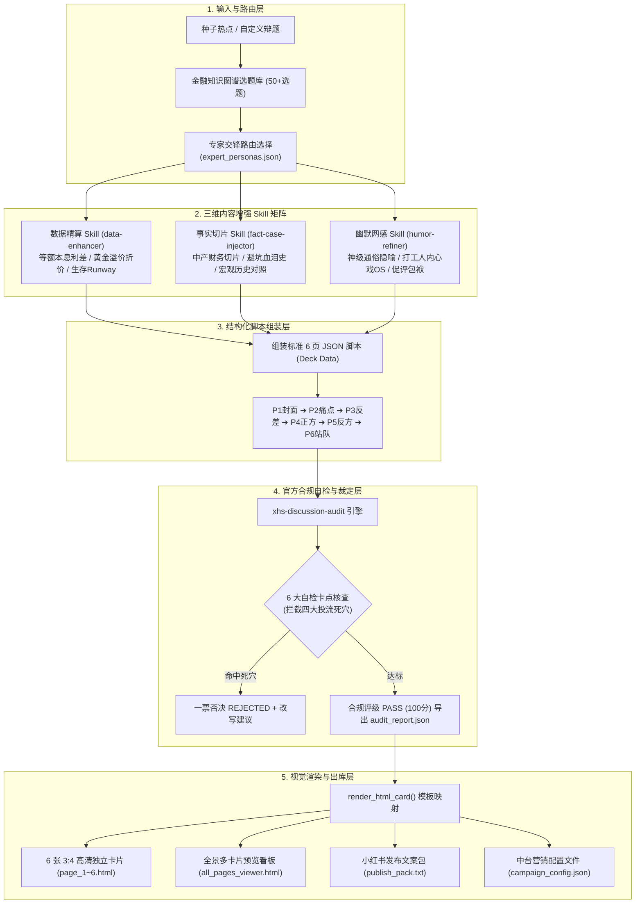
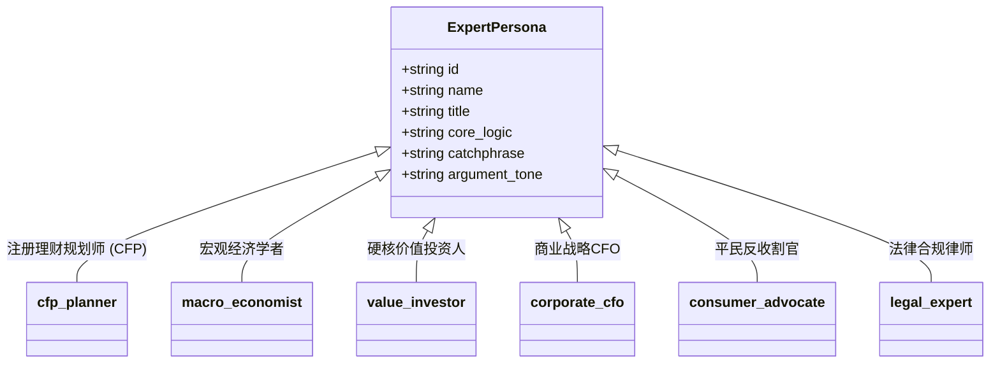

# tuwengongzuoliu (图文工作流) 完整项目深度分析报告 (v2.0 全面升级版)

> **文档定位**：小红书图文工业化全自动生产工作流系统 · 完整架构与多 Skill 协同深度剖析  
> **生成时间**：2026-09-10  
> **项目版本**：v2.0 (包含 51 个新增文件、7800+ 行代码与全新中台工作台)  
> **对齐提交**：`8d1df0e style: switch UI to pure white modern light theme`  
> **适用对象**：架构师、全栈工程师、Agent 开发者、新媒体内容运营总监  

---

## 目录

1. [项目演进背景与业务全景](#一-项目演进背景与业务全景)
2. [全景系统架构与拓扑图](#二-全景系统架构与拓扑图)
3. [最新目录结构与代码映射](#三-最新目录结构与代码映射)
4. [四大工业级 Agent Skills 协同网络](#四-四大工业级-agent-skills-协同网络)
5. [六大金融专家视角交锋矩阵 (Expert Personas Matrix)](#五-六大金融专家视角交锋矩阵-expert-personas-matrix)
6. [流水线调度中枢深度解析 (`pipeline/auto_generate_note.py`)](#六-流水线调度中枢深度解析-pipelineauto_generate_notepy)
7. [全新可视化工作台：Campaign Operation Studio (`index.html`)](#七-全新可视化工作台campaign-operation-studio-indexhtml)
8. [三大落地交付物金标样板全景剖析](#八-三大落地交付物金标样板全景剖析)
9. [客观工程诊断与后续落地路线图](#九-客观工程诊断与后续落地路线图)

---

## 一、 项目演进背景与业务全景

### 1.1 从“单脚本原型”到“内容工业中台”的跃升
在早期版本中，`tuwengongzuoliu` 仅是一个面向“50万房贷提前还款 vs 理财”的静态脚手架；而在经历最新一轮的重构与扩充后，系统正式演进为**集“专家矩阵路由、三维内容增强（精算/案例/幽默）、合规质检拦截、3:4 高清渲染、运营中台营销配置”于一体的端到端图文工业化系统**。

### 1.2 商业与活动目标对齐
* **对标官方活动**：小红书「理性讨论」官方扶持活动（专注于财经、职场、历史、法律、军事等高争议垂类）。
* **流量底盘**：单篇只要符合官方“具体对象 + 限制条件 + 开放问题 + 邀请站队”范式，即可享受 **10万 ～ 20万 官方曝光扶持**。
* **阶梯券激励与冲档体系**：
  * **新人首发奖**：首次提交合规笔记 ➔ **1 张 1000 流量券**；
  * **创作参与奖**：当周 2~4 篇 且 有效评论 ≥ 20 ➔ **1 张 1000 流量券**；
  * **持续创作奖**：当周 5~9 篇 且 有效评论 ≥ 50 ➔ **2 张 1000 流量券**；
  * **优质共创奖**：当周 ≥ 10 篇 且 有效评论 ≥ 150 ➔ **3 张 1000 流量券**；
  * **高热讨论奖**：单篇有效评论 ≥ 500 ➔ **5 张 1000 流量券**；
  * **双榜 TOP 3**：活跃榜 / 讨论榜前 3 名 ➔ 官方限定专属 T 恤。
* **履约生命线**：发布后 5 分钟内完成置顶神评促评，并即时填报腾讯文档收集表。

---

## 二、 全景系统架构与拓扑图

系统采用**低耦合、多技能插拔、数据驱动渲染**的微服务/模块化设计，无需 Node.js 打包构建，依靠原生 Python + 现代前端 DOM 渲染极速执行：



---

## 三、 最新目录结构与代码映射

```text
tuwengongzuoliu/
├── index.html                                     # 全新 Campaign Operation Studio 可视化工作台 (1616行)
├── web/index.html                                 # Web 端同步纯白现代化工作台
├── README.md                                      # 项目主说明文档 (v2.0 升级版)
├── pipeline/                                      # 核心自动化调度流水线
│   ├── auto_generate_note.py                      # 核心调度脚本 (941行，串联四大 Skill 与专家矩阵)
│   └── expert_personas.json                       # 六大专家角色库与议题路由配置表
├── skills/                                        # 四大工业级 Agent Skills 引擎
│   ├── xhs-discussion-audit/                      # Skill 1: 官方合规自检与改写技能
│   │   ├── SKILL.md
│   │   ├── rules.json
│   │   └── scripts/audit_note.py                  # 166行质检与打分脚本
│   ├── data-enhancer/                             # Skill 2: 数据量化与利差精算技能
│   │   ├── SKILL.md
│   │   └── scripts/
│   │       ├── finance_math.py                    # 房贷利差、黄金溢价等数学引擎 (123行)
│   │       └── enhance_data.py                    # 数据注入适配器
│   ├── fact-case-injector/                        # Skill 3: 真实事实案例切片技能
│   │   ├── SKILL.md
│   │   ├── database/case_library.json             # 真实案例数据库 (中产切片/避坑惨案/周期镜鉴)
│   │   └── scripts/inject_cases.py                # 案例检索与注入脚本
│   └── humor-refiner/                             # Skill 4: 幽默网感与通俗隐喻技能
│       ├── SKILL.md
│       └── scripts/refine_humor.py                # 神级通俗比喻、打工人自嘲与括号OS
├── docs/                                          # 5 份核心战略、SOP 与规范文档
│   ├── expert_perspectives_framework.md           # 专家交锋框架设计规范
│   ├── campaign_workflow_sop.md                   # 官方活动运营与履约 SOP
│   ├── finance_knowledge_graph_planning.md        # 三维金融知识图谱与50+选题规划
│   ├── finance_note_production_workflow.md        # 7 节点工业化生产流程 SOP
│   └── automated_image_text_workflow_architecture.md # 系统技术架构与 JSON Schema
├── templates/                                     # 3 款轻量交互式工具
│   ├── pipeline_controller.html                   # 流水线控制器
│   ├── incentive_calculator.html                  # 活动收益测算器
│   └── finance_graph_explorer.html                # 金融知识图谱罗盘
├── examples/                                      # 3 套完整交付物金标案例
│   ├── mortgage_vs_invest/                        # 示例1：提前还贷 vs 买理财
│   ├── gold_beans/                                # 示例2：年轻人攒金豆争议
│   └── options_rich_or_ruin/                      # 示例3：期权交易爆富 vs 绞肉机
├── prds/                                          # 项目文档与规划资产
│   ├── project_analysis_report.md                 # 基础分析报告 (v1.1)
│   └── project_analysis_report_v2.md              # 完整项目深度分析报告 (v2.0 本文档)
├── start_viewer.ps1 / .bat                        # 本地 8765 端口服务启动脚本
└── stop_server.ps1 / .bat                         # 本地预览服务关闭脚本
```

---

## 四、 四大工业级 Agent Skills 协同网络

### 4.1 官方合规自检 Skill (`xhs-discussion-audit`)
* **作用**：质检与安全阀，确保单篇符合官方 10万~20万 扶持曝光要求。
* **四大投流死穴（一票否决）**：
  1. `personal_experience`（个人流水账，如“求职日记”、“打卡第N天”）；
  2. `tutorial_teaching`（方法教学/攻略，如“保姆级避坑”、“手把手教学”）；
  3. `motivational_summary`（励志鸡汤，如“狠狠搞钱”、“终于想通了”）；
  4. `lifestyle_attitude`（主观生活态度，如“松弛感生活”、“沉浸式开箱”）。
* **评分裁定机制**：
  * 设问句检测（非设问 -25 分）；
  * 空泛设问检测（“你怎么看” -15 分）；
  * 命中死穴（-40 分并触发一票否决）；
  * 缺少限定条件（-15 分）；
  * 答案单一缺乏对立面（-10 分）；
  * `Score ≥ 80` 且无死穴：**PASS (推荐投流 ✅)**。

---

### 4.2 数据量化精算 Skill (`data-enhancer`)
* **作用**：拒绝空洞定性说教，用硬核数据精算建立权威信任背书。
* **内置量化模型 (`skills/data-enhancer/scripts/finance_math.py`)**：
  * **等额本息提前还款省息精算 (`calc_mortgage_prepayment`)**：
    $$\text{月供} = P \cdot \frac{r(1+r)^n}{(1+r)^n - 1}$$
    精确计算 50 万提前还款在 4.0% 利率下省下的 35 万利息，以及每月月供减压额与同期定存的年息差。
  * **黄金溢价与回购变现折价模型 (`calc_gold_premium_and_loss`)**：
    计算专柜买入工艺溢价（`craft_premium_pct`）、回购火熔折旧损失（`immediate_loss_pct`）与保本黄金大盘价（`breakeven_spot_price`）。
  * **家庭极端生存久期模型 (`calc_emergency_cash_runway`)**：
    测算家庭在突发降薪或全员失业时的生存缓冲月份（现金除以刚性生活与负债支出）。
  * **高股息抵御股价回撤模型 (`calc_dividend_vs_drawdown`)**：
    测算资本利得回撤需要持有分红多少年才能打平本金。

---

### 4.3 事实案例切片 Skill (`fact-case-injector`)
* **作用**：让读者产生“这就是我身边的事情”的极强代入感。
* **案例库组织 (`skills/fact-case-injector/database/case_library.json`)**：
  * **正方真人切片**：如北京 37 岁程序员提前还贷结清大半，半年后面临部门 35% 降薪，月供从 9600 降至 2200 元，从容抗住行业下行；
  * **反方避坑警示**：如杭州外企中层把 80 万应急备用金全还贷，半年后突发失业叠加老人重病需 20 万手术费，房屋无法快速折现，最终被迫申请年化 12% 高息消费贷；
  * **历史周期对照**：日本 1990 年代资产负债表破裂中，高杠杆投机家庭 vs 保留现金缓冲垫家庭的生存结局对照。

---

### 4.4 幽默网感赋能 Skill (`humor-refiner`)
* **作用**：把冰冷深奥的金融概念化为社交梗与生动隐喻，大幅拉长停留时长与促评盖楼。
* **幽默语料特征 (`skills/humor-refiner/scripts/refine_humor.py`)**：
  * **神级通俗隐喻**：
    * *“把现金全还进水泥里，就像给大门装了三道指纹锁，结果把自己的钥匙反锁在门里！”*
    * *“玩期权买方就像每天高价买保质期只有7天的隔夜酸奶；玩卖方期权就像在铁轨上捡一分钱硬币，把整个身家枕在铁轨上等火车开过来！”*
  * **打工人扎心内心戏 OS**：
    * `（打工人独白：只要不用每月看催款短信，晚上能睡个踏实觉，比什么通胀理论都管用！）`
    * `（银行经理潜台词：感谢大善人提前结清低息贷款！顺便请了解一下我们年化9%的信用消费贷？）`
  * **置顶神评促评包袱**：开篇率先抛出自我嘲讽或算账切片，引导评论区站队。

---

## 五、 六大金融专家视角交锋矩阵 (Expert Personas Matrix)

在 [`pipeline/expert_personas.json`](file:///D:/cadabra_tools003/AgentPro/tuwengongzuoliu/pipeline/expert_personas.json) 中，系统定义了 6 位不同背景的硬核专家人格，并在 6 页卡片中深度参与立论：



### 专家阵营在 6 页卡片中的分工落地：
1. **P1 封面**：展示红蓝对抗 Badge（如 `⚖️ 专家对决: 平民反收割官 VS 国际理财规划师`）；
2. **P2 痛点**：由反收割官或理财师抛出具体数据账本；
3. **P3 剪刀差**：引入第三方穿透专家（如宏观学者或价值投资人），揭露常识盲区背后的周期真相；
4. **P4 正方立论**：专家 A 亮明身份，提供 3 条硬核论点 + 代表金句；
5. **P5 反方立论**：专家 B 针锋相对，提供 3 条抗风险论点 + 代表金句；
6. **P6 终极站队**：直接引导用户“站队专家 A”或“站队专家 B”，激发评论区阵营交锋。

---

## 六、 流水线调度中枢深度解析 (`pipeline/auto_generate_note.py`)

脚本现已扩充至 **941 行**，全面负责自动化组装与物料生成：

### 6.1 核心执行流程
1. **参数解析**：支持 `--topic-id`（如 `mortgage_vs_invest`, `gold_beans`, `options_rich_or_ruin`），支持指定 `--topic`、`--category`、`--output`，以及通过 `--no-data`、`--no-cases`、`--no-humor` 按需关闭特定 Skill。
2. **专家视角加载**：调用 `load_expert_personas()` 读取角色配置。
3. **三维 Skill 链式流水线注入**：
   ```python
   # 1. 注入量化数据
   if use_data: mock_data = enhance_deck_data(mock_data)
   # 2. 注入事实切片案例
   if use_cases: mock_data = inject_cases_into_deck(mock_data)
   # 3. 注入幽默通俗隐喻与内心戏
   if use_humor: mock_data = polish_humor_for_deck(mock_data)
   ```
4. **合规质检**：执行 `audit_note()` 校验标题与正文合规性。
5. **批量卡片生成**：循环调用 `render_html_card()`，输出 6 个基于 Tailwind CSS 的 3:4 独立卡片。
6. **营销中台配置文件输出**：导出 `campaign_config.json`，结构化定义正反方阵营、初始支持率、4 大日常促评任务（阅读、投票、写账本、邀请）、抽奖奖池概率与数据埋点。
7. **全景看板装配**：输出 `all_pages_viewer.html`，顶部带有技能装配状态指示条与三专家矩阵面板。

---

## 七、 全新可视化工作台：Campaign Operation Studio (`index.html`)

位于根目录的 [`index.html`](file:///D:/cadabra_tools003/AgentPro/tuwengongzuoliu/index.html) 与 [`web/index.html`](file:///D:/cadabra_tools003/AgentPro/tuwengongzuoliu/web/index.html) 是专为内容创作者与运营人员打造的交互式工作台：

* **纯白现代极简视觉（Pure White Modern Light Theme）**：高质感卡片、细腻微阴影与圆角设计。
* **拟真手机 3:4 视口预览器**：中间居中呈现逼真的手机外壳模型，支持一键翻页查看 P1~P6 卡片的高保真实时渲染效果。
* **选题极速切换**：下拉菜单可一键切换“提前还房贷”、“年轻人攒金豆”、“期权暴富 vs 归零”等经典议题。
* **三维 Skill 赋能指示器**：实时呈现数据精算量化数值、事实案例摘要、幽默隐喻与内心戏。
* **一键出库操作**：
  * 按钮一：📋 复制发布文案（自动带小红书标签与置顶神评）；
  * 按钮二：📥 导出中台配置 JSON（`campaign_config.json`）。

---

## 八、 三大落地交付物金标样板全景剖析

每个案例均位于 `examples/` 目录下，并提供标准“全家桶”资产：

| 案例目录 | 核心议题与专家阵营 | 核心数据模型与隐喻 | 交付文件清单 |
| :--- | :--- | :--- | :--- |
| [`examples/mortgage_vs_invest/`](file:///D:/cadabra_tools003/AgentPro/tuwengongzuoliu/examples/mortgage_vs_invest/) | **提前还贷 vs 买理财**<br/>平民反收割官 VS 国际理财师 (宏观学者穿透) | **数据**：50万省利息35万/月供降2400元/Runway模型<br/>**隐喻**：把钥匙反锁在水泥大门里 | `page_1~6.html`<br/>`all_pages_viewer.html`<br/>`audit_report.json`<br/>`campaign_config.json`<br/>`publish_pack.txt` |
| [`examples/gold_beans/`](file:///D:/cadabra_tools003/AgentPro/tuwengongzuoliu/examples/gold_beans/) | **年轻人攒金豆：储蓄还是割韭菜**<br/>宏观经济学者 VS 平民反收割官 (价值投资人穿透) | **数据**：专柜750元/回收630元/工艺溢价15%/折价18%<br/>**隐喻**：包裹着金箔的情绪布洛芬 | 同上 |
| [`examples/options_rich_or_ruin/`](file:///D:/cadabra_tools003/AgentPro/tuwengongzuoliu/examples/options_rich_or_ruin/) | **期权交易：杠杆神器还是赌场**<br/>极端买方博弈者 VS 机构做市商 (合规律师穿透) | **数据**：买方95%归零/卖方胜率高但无限回撤<br/>**隐喻**：买保质期7天的隔夜酸奶/铁轨上捡硬币 | 同上 |

---

## 九、 客观工程诊断与后续落地路线图

### 9.1 当前已具备的核心优势
1. **内容逻辑高维降维**：不仅懂代码，更深刻吃透了小红书平台“促评”、“冲突感”、“认知差”、“两极对立”的传播本质。
2. **多 Skill 架构解耦极佳**：精算、案例、幽默、审核分立，既能被 `auto_generate_note.py` 一键全开装配，也能单个独立在命令行或 Agent 中调用。
3. **交付格式开箱即用**：直接提供可发布的配文、置顶神评及全景预览，创作者体验极其平滑。

### 9.2 关键工程瓶颈（客观存在）
1. **动态任意议题泛化（LLM 接入）**：
   * 目前系统针对预设的 3 个 `topic_id`（房贷、金豆、期权）具有完整的硬编码规则、案例和公式；
   * 如果创作者输入一个库中完全没有的新议题（例如“预制菜进校园”、“延迟退休与灵活就业”），系统需要真正接入 LLM API（如 Gemini 1.5/2.0、Claude 3.5 或 GPT-4o），利用预设的 System Prompt 动态调用专家并编排 JSON 脚本。
2. **自动化图片导出 (Headless Export)**：
   * 目前最终产物是 `.html` 文件，创作者发布到小红书仍需在浏览器截屏或手动另存；
   * 后续可引入 Python `playwright` 脚本，在后台无头渲染并秒级输出 `1080×1440` 的高清 PNG 格式卡片。

---
*(本报告已归档于 `prds/project_analysis_report_v2.md`)*
