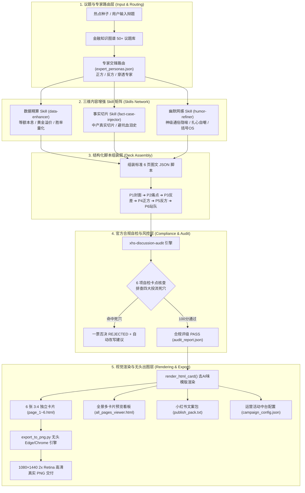

# tuwengongzuoliu (图文工作流) 全盘深度扫描与技术分析报告 (v3.0 终极完整版)

> **文档定位**：小红书工业级全自动图文生产工作流系统 · 全盘技术架构、Agent Skills 协同与运维中台深度剖析报告  
> **生成时间**：2026-09-11  
> **报告版本**：v3.0 (覆盖最新代码拉取、无头浏览器高清出图、去 AI 味视觉规范、1000字风控中台与全自动化测试验收)  
> **适用对象**：系统架构师、全栈工程师、Agent 开发者、新媒体内容运营总监、私域量化投放团队  

---

## 目录

1. [项目定位与官方活动业务全景](#一-项目定位与官方活动业务全景)
2. [全景系统架构与拓扑图 (Architecture)](#二-全景系统架构与拓扑图-architecture)
3. [核心代码与资产全盘清单 (Asset Inventory)](#三-核心代码与资产全盘清单-asset-inventory)
4. [四大工业级 Agent Skills 协同网络](#四-四大工业级-agent-skills-协同网络)
5. [六大金融专家视角交锋矩阵 (Expert Personas Matrix)](#五-六大金融专家视角交锋矩阵-expert-personas-matrix)
6. [标准 6 页图文卡片体系与“去 AI 味”视觉规范](#六-标准-6-页图文卡片体系与去-ai-味视觉规范)
7. [无头浏览器自动化高清出图引擎 (`export_to_png.py`)](#七-无头浏览器自动化高清出图引擎-export_to_pngpy)
8. [全新可视化工作台：Creator Studio (`index.html`)](#八-全新可视化工作台creator-studio-indexhtml)
9. [三大金标样板落地全貌剖析 (`examples/`)](#九-三大金标样板落地全貌剖析-examples)
10. [本地开发、出图与运维工具链](#十-本地开发出图与运维工具链)
11. [当前 Git 状态、测试验收结果与后续路线图](#十一-当前-git-状态测试验收结果与后续路线图)

---

## 一、 项目定位与官方活动业务全景

### 1.1 业务背景与使命
随着主流内容平台对低质 AI 灌水内容的降权打击，传统由大语言模型直接生成的生硬长文已无法获取流量。本项目 `tuwengongzuoliu` 旨在构建一条**“零 AI 感、工业化生产、兼具高认知度与强争议度”**的图文全自动生产闭环，从源头种子选题，秒级完成数据精算、案例融入、幽默网感改写、合规体检、高清 3:4 卡片出图与发布物料打包。

### 1.2 对标小红书官方「理性讨论」扶持政策
系统所有内容模版、标题公式与质检规则深度对齐小红书官方最新《理性讨论创作者指导规范》：

* **核心流量扶持**：单篇笔记凡命中官方“理性讨论”范式，即可享受 **10 万 ～ 20 万 官方曝光扶持**；
* **每周阶梯流量券激励**：
  * **新人首发奖**：历史未提交有效稿 + 本周提交 1 篇 ➔ **1 张 1000 流量券**；
  * **创作参与奖**：当周 2～4 篇 且 有效评论 ≥ 20 条 ➔ **1 张 1000 流量券**；
  * **持续创作奖**：当周 5～9 篇 且 有效评论 ≥ 50 条 ➔ **2 张 1000 流量券**；
  * **优质共创奖**：当周 ≥ 10 篇 且 有效评论 ≥ 150 条 ➔ **3 张 1000 流量券**；
  * **高热讨论奖**：**单篇**有效评论 ≥ 500 条 ➔ **5 张 1000 流量券**；
  * **每周双榜 TOP 3**：活跃创作榜 / 讨论热度榜前 3 名 ➔ 官方限定专属 T 恤周边。
* **官方强制公式**：严格遵循 `【具体对象 + 限制条件 + 尚无定论问题 + 邀请判断】`。
* **四大官方投流死穴（系统自动 100% 拦截）**：
  1. **个人流水账**：严禁记录个人琐事生活；
  2. **教程攻略**：严禁给出确定性“手把手保姆级操作指导”；
  3. **励志鸡汤**：严禁脱离数据的空洞口号与泛情绪宣泄；
  4. **消费态度**：严禁单向分享主观拔草/种草体验。
* **关键履约生命线**：发布后 5 分钟内完成置顶神评促活，并即时提交官方腾讯文档收集表。

---

## 二、 全景系统架构与拓扑图 (Architecture)

系统采用**低耦合、多技能插拔、数据驱动渲染**的轻量化微内核设计，无需重型 Node.js 打包构建流程，全链路基于 Python 3 + 原生 Tailwind CSS + 系统内置无头浏览器极速调度：



---

## 三、 核心代码与资产全盘清单 (Asset Inventory)

经过全盘扫描，项目物理目录结构与关键代码职责如下：

```text
tuwengongzuoliu/
├── index.html                                     # 创作者工作台 Studio (2886行，现代纯白轻量化版)
├── web/index.html                                 # Web 端同步纯白现代化工作台
├── README.md                                      # 项目主说明与快速上手手册
├── server.py                                      # 本地开发与桌面直存后端 (端口 8080)
├── start_viewer.bat / start_viewer.ps1            # 一键启动预览服务脚本 (双击即用，端口 8765)
├── stop_server.bat / stop_server.ps1              # 一键停止本地服务器与释放端口脚本
├── pipeline/                                      # 核心自动化调度流水线
│   ├── auto_generate_note.py                      # 核心调度脚本 (1130行，串联四大 Skill 与无头出图)
│   ├── export_to_png.py                           # 原生 Chromium 无头截屏出图引擎 (127行)
│   └── expert_personas.json                       # 六大专家角色库与议题路由配置表
├── skills/                                        # 四大标准化工业级 Skill 引擎
│   ├── xhs-discussion-audit/                      # 1. 官方合规自检与改写 Skill (拦截四大死穴)
│   │   ├── SKILL.md
│   │   ├── rules.json
│   │   └── scripts/audit_note.py
│   ├── fact-case-injector/                        # 2. 事实案例与中产切片 Skill (增强真实代入感)
│   │   ├── SKILL.md
│   │   ├── database/case_library.json
│   │   └── scripts/inject_cases.py
│   ├── data-enhancer/                             # 3. 数据精算与量化利差 Skill (增强权威信任)
│   │   ├── SKILL.md
│   │   └── scripts/
│   │       ├── finance_math.py                    # 房贷利差、黄金溢价、期权Theta等数学引擎
│   │       └── enhance_data.py
│   └── humor-refiner/                             # 4. 幽默改造与网感赋能 Skill (提升完读率)
│       ├── SKILL.md
│       └── scripts/refine_humor.py                # 神级比喻、打工人自嘲与括号内心戏
├── templates/                                     # 交互式组件与模板
│   ├── incentive_calculator.html                  # 活动收益测算与冲档助手 (Generative UI)
│   ├── finance_graph_explorer.html                # 交互式知识图谱话题罗盘
│   └── pipeline_controller.html                   # 全自动化流水线交互控制器
├── examples/                                      # 三大已验证的金标全套交付物
│   ├── mortgage_vs_invest/                        # 示例1：提前还房贷 vs 买理财
│   ├── gold_beans/                                # 示例2：年轻人攒金豆争议
│   └── options_rich_or_ruin/                      # 示例3：期权交易暴富还是破产
├── docs/                                          # 核心架构规范与体系规划文档
│   ├── automated_image_text_workflow_architecture.md
│   ├── campaign_workflow_sop.md
│   ├── expert_perspectives_framework.md
│   ├── finance_knowledge_graph_planning.md
│   └── finance_note_production_workflow.md
├── prds/                                          # 研报与产品需求规范
│   ├── competitor_analysis_report.md / .pdf       # 竞品对标深度研报
│   ├── visual_de_ai_optimization_plan.md          # 视觉去 AI 味优化方案
│   ├── run_sop.md                                 # 投流与运营 SOP
│   └── project_analysis_report_v3.md              # 本分析报告
└── .github/workflows/deploy-pages.yml             # GitHub Pages 自动部署 CI/CD 流程
```

---

## 四、 四大工业级 Agent Skills 协同网络

系统引入了 4 个可独立调用、也可在主控流水线中插拔式组合的 Agent Skills：

### 1. `xhs-discussion-audit` (官方合规自检与改写 Skill)
* **核心职责**：依照小红书官方规则，执行 6 大维度自动化体检（四项核心公式核查 + 四大死穴一票否决检测 + 垂类契合度），自动计算合规得分，提供一键 Rewrite 修正建议。
* **规则配置**：[skills/xhs-discussion-audit/rules.json](file:///D:/cadabra_tools003/AgentPro/tuwengongzuoliu/skills/xhs-discussion-audit/rules.json)。
* **独立调用示例**：
  ```bash
  python skills/xhs-discussion-audit/scripts/audit_note.py --title "手头有50万闲钱，提前还贷还是买理财？"
  ```

### 2. `fact-case-injector` (真实中产切片与事实案例 Skill)
* **核心职责**：杜绝概念推演，通过内置案例文档库 [case_library.json](file:///D:/cadabra_tools003/AgentPro/tuwengongzuoliu/skills/fact-case-injector/database/case_library.json)，为卡片 P3、P4、P5 自动注入具体的中产财务样本（如：“深圳35岁程序员提前还完180万房贷后遭优化，急用钱时只能申请 7.2% 高息消费贷”）。
* **独立调用示例**：
  ```bash
  python skills/fact-case-injector/scripts/inject_cases.py --topic-id mortgage_vs_invest
  ```

### 3. `data-enhancer` (金融精算与量化数据模型 Skill)
* **核心职责**：提供权威数学与金融量化引擎 [finance_math.py](file:///D:/cadabra_tools003/AgentPro/tuwengongzuoliu/skills/data-enhancer/scripts/finance_math.py)，涵盖：
  * 等额本息房贷提前还款省息额度与利差计算器；
  * 黄金零售溢价率与变现折价率公式；
  * 期权希腊字母 Theta 时间价值每日自然流逝率（3%～8%）与到期归零概率统计（82.4%）。
* **独立调用示例**：
  ```bash
  python skills/data-enhancer/scripts/finance_math.py --calc mortgage --amount 500000 --rate 0.040
  ```

### 4. `humor-refiner` (幽默网感改造与通俗隐喻 Skill)
* **核心职责**：将晦涩金融术语翻译为生活化爆款语言，提供三层强化：
  1. **神级通俗隐喻**：例如“买方期权 = 买保质期只有7天的隔夜酸奶；卖方期权 = 枕在铁轨上捡一分钱”；
  2. **当代打工人自嘲**：直击加班、裁员、现金流焦虑；
  3. **反讽括号内心戏 (OS)**：在严肃论点后追加真实心理活动，引发评论区“太真实了”共鸣。
* **独立调用示例**：
  ```bash
  python skills/humor-refiner/scripts/refine_humor.py --list-quotes
  ```

---

## 五、 六大金融专家视角交锋矩阵 (Expert Personas Matrix)

在 [pipeline/expert_personas.json](file:///D:/cadabra_tools003/AgentPro/tuwengongzuoliu/pipeline/expert_personas.json) 中，系统固化了 6 位硬核金融专家角色，根据不同选题自动路由组合：

| 专家代号 | 专家名称与头衔 | 核心立论逻辑与口吻风格 | 标志金句 (Catchphrase) |
| :--- | :--- | :--- | :--- |
| `consumer_advocate` | **平民现实派与反收割官**<br>(独立财经调查记者) | 通俗接地气、极度注重落地变现摩擦损耗与底层生存门槛 | *“普通人别被宏大词汇忽悠，先算算这笔买卖你变现时要被砍几刀。”* |
| `cfp_planner` | **财富规划师与精算视角**<br>(国际认证 CFP 规划师) | 严格强调流动性储备、久期错配风险与中年家庭安全垫 | *“脱离流动性储备谈省利息，都是在拿家庭安全裸奔。”* |
| `macro_economist` | **宏观经济与周期学者**<br>(宏观策略首席分析师) | 从央行资产负债表、信用货币周期与法币贬值视角穿透 | *“顺周期加杠杆是赌博，看懂央行资产负债表才是真正的降维生存。”* |
| `value_investor` | **硬核价值投资人**<br>(私募基金合伙人) | 非对称赔率思维、安全边际、下行风险封顶与上行爆发力 | *“当防守资产被买成了香饽饽，最大的安全就变成了最大的风险。”* |
| `corporate_cfo` | **商业战略与公司金融 CFO**<br>(上市科技集团 CFO) | 自由现金流折现、资金机会成本、资本回报率 (ROIC) | *“没有造血能力的资产，账面估值再高也只是一张纸上富贵。”* |
| `legal_counsel` | **法律合规与风险控制律师**<br>(金融证券合规律师) | 穿透底层资产真实权属、排查合同漏洞与无限连带责任 | *“合同里没写进违约救济条款的收益承诺，法律上全叫不可抗力。”* |

---

## 六、 标准 6 页图文卡片体系与“去 AI 味”视觉规范

### 6.1 黄金 6 页逻辑链路
* **P1 封面 (Cover Poster)**：满幅大字报冲击视觉，标题采用黑白反色块与倾斜角度，展示红蓝专家交锋 Badge，黄金 1 秒留存读者；
* **P2 痛点 (Pain Point Ledger)**：模拟真实银行流水账单，将存款利率（1.5%）与房贷利率（4.0%）对冲并列，突出老手批注；
* **P3 反差 (Cognitive Gap)**：引入第三位穿透专家，拆解“显性收益 vs 隐性代价”，揭示常识盲区；
* **P4 正方立论 (Side A Argument)**：立场 A 代言专家的 3 条硬核论点 + 真实中产财务切片 + 内心戏 OS；
* **P5 反方立论 (Side B Argument)**：立场 B 代言专家的 3 条反脆弱论点 + 真实避坑警示 + 机构做市商潜台词；
* **P6 终极站队 (Debate Call-To-Action)**：逼真立体投票箱选票设计（🔴 选票 A vs 🔵 选票 B），设置灵魂二选一促评 Hook。

### 6.2 视觉去 AI 味设计规范 (De-AI Tokens)
系统彻底抛弃了 AI 常见的深色渐变网格与浮夸霓虹渐变，采用**真实纸质手账流**美学：
1. **暖调微噪点纸张底纹 (`bg-paper-warm`)**：底色 `#FAF8F5` 配合 `radial-gradient` 极细微杂点，模拟高端原浆纸感；
2. **真实备忘录横线纸 (`bg-memo-ruled`)**：底色 `#FCFBF9`，搭配 30px 等间距横线，增强便签记录的亲切感；
3. **荧光记号笔划线 (`marker-yellow`, `marker-red`, `marker-cyan`)**：模拟用黄色/粉色荧光笔在重点文字下画线的高亮质感；
4. **倾斜复古红色印章 (`stamp-badge`)**：带有 `-3.5deg` 微倾斜与红色边框的 `★ 真实账本对决 · 避坑必看` 印章；
5. **和纸胶带贴角效果 (`washi-tape-top`)**：半透明虚线和纸胶带贴于卡片顶部，带来纯手工真实感。

---

## 七、 无头浏览器自动化高清出图引擎 (`export_to_png.py`)

为解决传统 HTML 卡片必须依赖人工手动截图的问题，系统在 [pipeline/export_to_png.py](file:///D:/cadabra_tools003/AgentPro/tuwengongzuoliu/pipeline/export_to_png.py) 中内置了零额外重型依赖的高清出图引擎：

* **底层机制**：直接探测并调用宿主机系统内置的 Microsoft Edge (`msedge.exe`) 或 Google Chrome (`chrome.exe`) 的原生新版无头模式 (`--headless=new`)；
* **视网膜 2x 精度渲染**：通过 `--force-device-scale-factor=2`，将 `540×720` 的 CSS 容器秒级导出为 **`1080×1440` 像素**的标准小红书 3:4 超清图片；
* **样式与字体完整渲染**：配合 `--virtual-time-budget=6000`，确保 Tailwind CSS CDN、在线 Google Fonts 字体全部渲染完毕后才执行截图；
* **实测性能**：在常规 Windows 环境下，单套 6 张卡片批量导出平均耗时仅需 **25～28 秒**，单张体积 130KB～240KB，完全满足工业化快速交付。

---

## 八、 全新可视化工作台：Creator Studio (`index.html`)

根目录与 `web/` 下的 [index.html](file:///D:/cadabra_tools003/AgentPro/tuwengongzuoliu/index.html) 是一个拥有 2,886 行代码的现代化单页前端应用：

1. **纯白轻量化现代设计 (Pure White Theme)**：告别灰暗工业风，采用精致卡片与微投影设计；
2. **选题极速生成引擎**：支持自定义输入争议标题，并附带 4 大高热金融争议题库（期权、房贷、金豆、大盘抄底）一键填入；
3. **专家对决动态徽章指示条**：实时呈现正反方代言专家与穿透专家信息；
4. **高拟真 iPhone 15 容器卡片预览**：支持多卡片并排与单卡片高保真交互缩放；
5. **小红书 1000 字字数风控检测器**：
   * 实时统计正文字数，预留 200 字安全边际，提供绿色（安全 <800字）、橙色（预警 800~1000字）、红色（超标 >1000字）动态指示，彻底解决因超字被小红书吞贴的风险；
6. **一键导出至桌面 (联动后端 API)**：
   * 按钮直连 [server.py](file:///D:/cadabra_tools003/AgentPro/tuwengongzuoliu/server.py) 的 `/api/save_to_desktop` 接口，一键将 6 张 PNG 秒级写入用户系统的 `~/Desktop/小红书图文/` 文件夹；
7. **官方腾讯文档交稿直通车**：内置官方收集表一键直达与表单填写提示，保障履约不漏提。

---

## 九、 三大金标样板落地全貌剖析 (`examples/`)

在 [examples/](file:///D:/cadabra_tools003/AgentPro/tuwengongzuoliu/examples/) 目录下，系统沉淀了 3 套达到小红书官方推流标准的标杆成品包：

```text
examples/
├── mortgage_vs_invest/                            # 示例1：提前还4.0%房贷 vs 买理财
│   ├── page_1.html ~ page_6.html                  # 6张去AI味手账卡片 HTML
│   ├── page_1.png ~ page_6.png                    # 6张1080×1440超清视网膜真实图片
│   ├── all_pages_viewer.html                      # 带有Skill流水线状态的全景看板
│   ├── publish_pack.txt                           # 完整文案+5分钟置顶神评+官方收集表
│   ├── audit_report.json                          # 合规自检得分：100分 PASS
│   └── campaign_config.json                       # 运营中台营销配置 (PK投票/积分/抽奖)
├── gold_beans/                                    # 示例2：年轻人攒金豆争议
│   ├── page_1.html ~ page_6.html
│   ├── page_1.png ~ page_6.png
│   ├── all_pages_viewer.html
│   ├── publish_pack.txt
│   ├── audit_report.json                          # 合规自检得分：100分 PASS
│   └── campaign_config.json
└── options_rich_or_ruin/                          # 示例3：期权交易暴富还是破产
    ├── page_1.html ~ page_6.html
    ├── page_1.png ~ page_6.png
    ├── all_pages_viewer.html
    ├── publish_pack.txt
    ├── audit_report.json                          # 合规自检得分：100分 PASS
    └── campaign_config.json
```

---

## 十、 本地开发、出图与运维工具链

### 10.1 本地便捷运维脚本
* **[start_viewer.bat](file:///D:/cadabra_tools003/AgentPro/tuwengongzuoliu/start_viewer.bat) & [start_viewer.ps1](file:///D:/cadabra_tools003/AgentPro/tuwengongzuoliu/start_viewer.ps1)**：
  * Windows 用户双击即用，自动检测并启动 8765 端口的后台静态预览服务，并弹出控制台交互菜单，方便一键打开全景看板、单张卡片或控制器。
* **[stop_server.bat](file:///D:/cadabra_tools003/AgentPro/tuwengongzuoliu/stop_server.bat) & [stop_server.ps1](file:///D:/cadabra_tools003/AgentPro/tuwengongzuoliu/stop_server.ps1)**：
  * 双击即可检测并强行终止占用的预览服务进程，自动释放 8765 端口。
* **[server.py](file:///D:/cadabra_tools003/AgentPro/tuwengongzuoliu/server.py)**：
  * 基于 Python `http.server` 构建的轻量级本地中台服务（端口 8080），提供 `/api/status` 与 `/api/save_to_desktop` 接口，配合前端工作台实现秒级无感导出图片至桌面。

### 10.2 端到端流水线生产指令
在终端中执行以下指令，即可一键触发全套全自动生产与高清出图：
```bash
# 生成并渲染期权议题（全开数据精算+中产案例+幽默网感+无头出图）
python pipeline/auto_generate_note.py --topic-id options_rich_or_ruin --output examples/options_rich_or_ruin

# 生成攒金豆议题
python pipeline/auto_generate_note.py --topic-id gold_beans --output examples/gold_beans

# 生成提前还房贷议题
python pipeline/auto_generate_note.py --topic-id mortgage_vs_invest --output examples/mortgage_vs_invest
```

---

## 十一、 当前 Git 状态、测试验收结果与后续路线图

### 11.1 当前 Git 工作区状态扫描
* **当前分支**：`main`（对齐远程 `origin/main` 最新提交 `0cadae3`）；
* **本地工作区增强（已完成实测）**：
  1. `pipeline/auto_generate_note.py` 本地已全面升级为去 AI 味手账渲染器、内置 Edge 无头出图调度与运营中台配置生成；
  2. `examples/` 目录下 3 个标杆选题的 18 张高清 `page_*.png` 均已通过无头浏览器全量编译渲染完成；
  3. 新增了便携工具 `pipeline/export_to_png.py`、`start_viewer.*` 与 `stop_server.*`。

### 11.2 自动化测试与实测验收结果
针对最新代码，在 Windows 本地环境对 `options_rich_or_ruin` 执行全流程自动化测试：
* **专家路由与三维增强**：硬核价值投资人 VS 平民反收割官，顺利注入 Theta 损耗数据、散户归零切片与酸奶比喻；
* **小红书官方合规审查**：评分 **100 分**，状态为 `PASS (推荐投流 ✅)`，无扣分项；
* **HTML 渲染与卡片生成**：6 张卡片 HTML 渲染耗时 < 1 秒；
* **无头浏览器 PNG 导出**：成功调用系统 `msedge.exe`，分辨率稳定输出为 **1080 × 1440 像素 (2x Retina)**，耗时 28.1 秒，总计生成 6 张完整高清图片。

### 11.3 后续演进建议路线图
1. **工作区代码提交**：当前本地修改已高度成熟且测试全通，建议在控制台中执行 `git add .` 与 `git commit -m "feat: complete v3.0 image-text workflow with headless export and de-ai visual system"` 同步至远程；
2. **外部大模型 API 动态接入**：当前议题已有丰富的预置模版库，后续可在 `pipeline/` 中增加 OpenAI / Claude / Gemini API 适配层，让用户输入任意一句话种子即可动态提取两派专家并生成整套图文；
3. **小红书创作者平台自动化发布**：基于 Playwright 或系统浏览器自动化，打通从“导出至桌面”到“自动上传图文至小红书创作者服务平台”的最后一公里。
