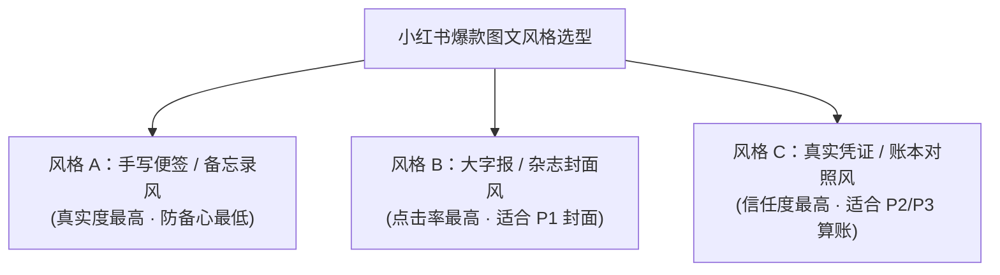

# 小红书图文“去 AI 味”视觉与内容深度优化方案

> **文档定位**：针对当前生成的图文卡片过于“程序化、AI味浓、后台弹窗感”的系统性重构指南  
> **生成时间**：2026-09-10  
> **归档路径**：`prds/visual_de_ai_optimization_plan.md`  
> **适用范围**：卡片渲染模板、Tailwind CSS 样式、排版构图与文案语气优化  

---

## 目录

1. [病灶诊断：当前卡片为什么“AI味”浓？](#一-病灶诊断当前卡片为什么ai味浓)
2. [去 AI 味的五大系统级优化方案](#二-去-ai-味的五大系统级优化方案)
3. [三大爆款视觉风格矩阵 (视觉方案选型)](#三-三大爆款视觉风格矩阵-视觉方案选型)
4. [工程实施步骤建议](#四-工程实施步骤建议)

---

## 一、 病灶诊断：当前卡片为什么“AI味”浓？

| 维度 | 当前卡片表现 (AI味 / 后台系统感) | 小红书爆款图文特征 (真人感 / 烟火气) |
| :--- | :--- | :--- |
| **1. 构图与留白** | **“后台弹窗组件”**：上下大片死白留空，内容通过 `my-auto` 挤在画面中间，缩略图完全看不清。 | **“满幅视觉冲击”**：标题占画幅 **50%~70%**，字号极大，上下呼应，视觉饱满抓人。 |
| **2. 配色与质感** | **“Tailwind 默认塑料色”**：纯白 `#FFFFFF`，冷蓝 `bg-blue-50`，纯平数字感，无质感。 | **“温润纸质与微纹理”**：米白纸张底色、微噪点（Noise/Grain）、荧光笔划线、便签贴纸。 |
| **3. 字体与层级** | **“单一思源黑体”**：全篇单字体，缺乏层次；数字无特色，缺乏跳跃率。 | **“大黑体 + 大数字 + 手写批注”**：粗犷大字 + 醒目衬线数字 + **真人手写圈画批注**。 |
| **4. 符号与元素** | **“原生 Emoji 大杂烩”**：堆砌系统 Emoji（💰 💡 ⚖️ 🔴 🔵），圆角规整呆板。 | **“手绘涂鸦 / 戳印 / 胶带”**：红色手画圈、黄色荧光笔痕迹、倾斜复古印章、切角胶带。 |
| **5. 文案与口吻** | **“对仗工整的书面腔”**：“锁定4%收益 VS 握紧流动性防裁员”，像研报 PPT。 | **“第一人称情绪大白话”**：“每月月供一扣卡里见底，中年人真不敢裸奔还贷啊！”。 |

---

## 二、 去 AI 味的五大系统级优化方案

### 1. 版式破局：从“弹窗居中”转向“大字报满幅张力”
* **标题尺寸翻倍**：P1 封面核心标题字号从 `text-3xl`（约 30px）提升至 `text-5xl` 或 `text-6xl`（60px~72px），行高收紧（`leading-none`），字距紧凑（`tracking-tighter`）。
* **非对称大字压顶**：打破绝对居中，采用“上方大字压顶 + 下方对撞高亮”的经典海报构图。
* **高反差底色块**：关键词（如“提前还贷”、“被砍两刀”、“倒贴15%”）增加高对比反色底块（黑底白字、荧光黄底黑字）。

### 2. 质感赋能：注入“物理世界的烟火气与现实凭证感”
* **纸质微纹理**：底色换用温润暖调米白（`#FDFBF7`），叠加 3%~5% 透明度的 SVG 细微颗粒噪点（Grain）。
* **真实物理细节**：
  * **荧光记号笔痕迹**：关键结论下方增加微倾斜的高亮色带；
  * **真实账单凭证感**：P2 账本做成带有千分位符、模拟银行 APP 账单明细或手写计算草稿纸的样式。

### 3. 三层字体系统：引入“真人红笔手写批注”
* **严肃大字层**：极粗力道黑体（大标题）。
* **权威数字层**：`50万`、`4.0%`、`35万` 换用复古粗衬线大字（`Bebas Neue` 或 `Georgia`），放大 2~3 倍。
* **灵魂批注层（去 AI 核心）**：在卡片边缘点缀 1~2 处倾斜手写体批注（如：`（千万别全还！！）`、`血泪教训！`），配手绘红箭头。

### 方案 4：元素去套路化：剔除“Emoji 大杂烩”，换为“硬核视觉印章”
* 废除所有彩色系统 Emoji；
* 引入倾斜 `-12deg` 的红色斑驳复古印章：`【实测避坑】`、`【真金账本】`、`【血亏预警】`；
* 对立阵营用贯穿式斜切色带（Versus Ribbon）代替小药丸胶囊标签。

### 方案 5：文案去机器化：从“咨询报告”到“打工人唠嗑”
* **短句断句**：“手头有50万闲钱，提前还贷还是买理财？” ➔ 改为：“**手头攒了50万，到底该不该提前还房贷？算完这笔账我直接沉默了……**”
* **具体生活体感**：“降低生存门槛” ➔ 改为：“**每月少还2400，晚上睡得踏实多了！就算明天被裁，兜里有粮心里不慌。**”

---

## 三、 三大爆款视觉风格矩阵 (视觉方案选型)

1. **风格 A【手机备忘录 / 手写便签风】**：
   * 牛皮纸/浅黄横线备忘录底色、纸夹与图钉元素、荧光笔划重点、手写感吐槽批注；
   * 心理暗示：这是作者私人的真实记账备忘录，零距离感。
2. **风格 B【冲击大字报 / 杂志封面风】**：
   * 经典黑白红/黑白黄对撞高对比、字号占画面 65% 以上、复古红印章；
   * 心理暗示：时代周刊/头条大事件冲击力，信息流划过 1 秒必停。
3. **风格 C【真实凭证 / 对账单风】**：
   * 模拟银行流水账单、热敏打印小票撕边、带千分位与具体日期的账本明细；
   * 心理暗示：真实客观的真凭实据，击碎任何编造感。

---

## 四、 工程实施步骤建议

1. **第一阶段（CSS 样式层重构）**：在卡片模版中引入纸张底色、SVG 噪点纹理、荧光高亮笔刷类、倾斜印章类样式。
2. **第二阶段（版式重构）**：重写 P1 封面为满幅大字报，重写 P2/P3 为对账凭证/便签纸。
3. **第三阶段（文案与字体注入）**：接入开源手写字体，注入第一人称口语化情绪文案。
