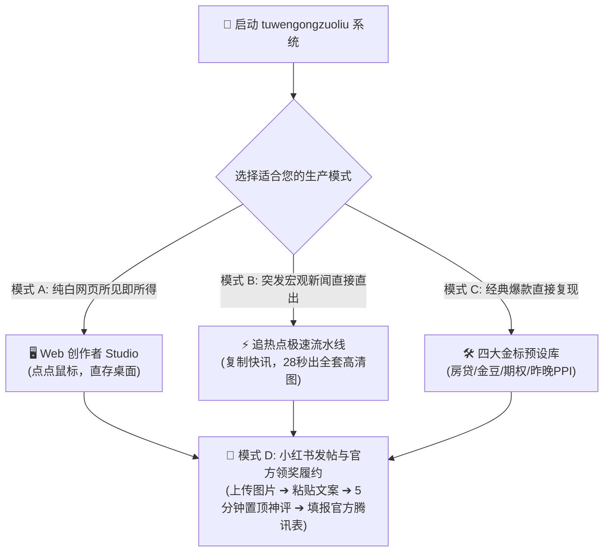

# 小红书工业级图文全自动生产工作流 · 完整实操玩法与运营履约 SOP 指南 (v3.0)

> **文档定位**：面向内容创作者、新媒体运营、量化投放团队的标准化全流程操作手册 (Playbook & SOP)  
> **生成时间**：2026-09-11  
> **版本**：v3.0 (包含纯白 Studio 工作台、热点新闻 28 秒秒级出图、四大金标议题与官方领奖履约闭环)  
> **对齐项目**：`tuwengongzuoliu` 最新主干  

---

## 目录

1. [核心玩法全览 (Four Operating Modes)](#一-核心玩法全览-four-operating-modes)
2. [模式 A：小白视觉流 (Web 创作者 Studio)](#二-模式-a小白视觉流-web-创作者-studio)
3. [模式 B：追热点极速流 (热点快讯 28 秒秒级出图)](#三-模式-b追热点极速流-热点快讯-28-秒秒级出图)
4. [模式 C：四大金标经典议题开箱即用](#四-模式-c四大金标经典议题开箱即用)
5. [模式 D：小红书发帖实操与官方领奖履约 SOP (保姆级闭环)](#五-模式-d小红书发帖实操与官方领奖履约-sop-保姆级闭环)
6. [小红书官方扶持奖励阶梯与冲档指南](#六-小红书官方扶持奖励阶梯与冲档指南)
7. [常用操作与运维工具速查表 (Cheat Sheet)](#七-常用操作与运维工具速查表-cheat-sheet)

---

## 一、 核心玩法全览 (Four Operating Modes)



---

## 二、 模式 A：小白视觉流 (Web 创作者 Studio)

适合不习惯敲命令行的创作者，在现代化纯白单页界面中完成输入、字数检测、高拟真 iPhone 预览与一键直存桌面。

### 第 1 步：启动本地工作台
在项目根目录双击运行脚本：
👉 [start_viewer.bat](file:///D:/cadabra_tools003/AgentPro/tuwengongzuoliu/start_viewer.bat)  
或者在终端中运行 Python 本地中台服务：
```powershell
python server.py
```
* 控制台将提示：`Server started at http://localhost:8080`；
* 服务启动时会自动在您的 Windows 桌面上创建文件夹：`C:\Users\Cadabra\Desktop\小红书图文`。

### 第 2 步：浏览器打开创作者 Studio
在 Chrome 或 Edge 浏览器中访问：
👉 **`http://localhost:8080/index.html`**

### 第 3 步：一键生成或选择选题
1. **热门灵感药丸**：点击输入框下方的选题药丸（如 `期权会让人暴富还是破产？`、`手头有50万提前还贷还是理财？`、`年轻人攒金豆` 等）；
2. **自定义输入**：在输入框键入您想探讨的任何金融/职场争议标题，点击 **【⚡ 快速生成对应内容与图片】**；
3. 系统在 0.6 秒内完成红蓝专家对决匹配、账本组装与 100 分合规检测。

### 第 4 步：实时预览与 1000 字风控检测
* **真实 iPhone 效果**：在右侧的手机模拟器中，点击下方缩略图（P1~P6），可翻页检查每张卡片的暖调手账排版；
* **字数风控检测**：中间栏的字数指示器会自动统计，绿色代表字数在 800 字以内，确保发布到小红书不会被折叠或吞贴。

### 第 5 步：一键出图与复制物料
1. 点击顶部右上角的 **【🖼️ 一键下载至桌面【小红书图文】】**：
   * 6 张卡片将自动在后台转换完毕，直接写入你的系统桌面 `~/Desktop/小红书图文/` 文件夹内，**省去任何手动截图和右键另存为！**
2. 点击 **【📋 复制文案】**：已一键打包好标题、正文、小红书官方推荐标签、5 分钟内置顶神评。

---

## 三、 模式 B：追热点极速流 (热点快讯 28 秒秒级出图)

当遇到突发重大经济数据（如**昨晚的 PPI**、**今晚的 CPI**、**美联储降息决议**、**黄金跳水**、**大盘巨震**）时，只需复制一段新闻文字即可秒级全自动出图。

### 第 1 步：打开命令行终端
在项目根目录按住 `Shift + 鼠标右键` ➔ 选择 **“在此处打开 PowerShell 窗口”**（或 CMD）。

### 第 2 步：贴入新闻执行全自动流水线
直接运行 [auto_news_pipeline.py](file:///D:/cadabra_tools003/AgentPro/tuwengongzuoliu/pipeline/auto_news_pipeline.py)，把新闻贴在引号里：

```powershell
python pipeline/auto_news_pipeline.py --news "昨晚美国公布8月PPI同比上涨5.4%超出预期，加息预期飙升至70%，美债收益率狂飙，黄金暴跌" --output examples/today_ppi_post
```

### 第 3 步：静候 28 秒，全套物料自动交付
系统会自动在后台静默执行以下动作（无需任何人工干预）：
1. 🧠 **合规提炼**：自动把零散新闻重构为小红书官方四要素标题（如《昨晚数据突发大逆转：通胀再抬头，普通人该抛售资产还是逆向抄底？》）；
2. ⚖️ **专家对决**：自动从专家库中路由 `宏观经济学者`（现金防御） VS `硬核价值投资人`（逆向抄底），穿透视角选 `平民反收割官`；
3. 🛡️ **100 分自检**：自动调用 `xhs-discussion-audit` 排查 4 大死穴，输出合规报告；
4. 🎨 **手账排版**：渲染 6 张去 AI 味的真实手账纸质卡片；
5. 📸 **无头截图**：后台静默调用系统 Edge/Chrome 浏览器内核，秒级导出 **1080×1440 2x Retina** 超清真实 PNG！

### 第 4 步：检查交付成果
直接在文件资源管理器中打开产出目录（如 [examples/today_ppi_post/](file:///D:/cadabra_tools003/AgentPro/tuwengongzuoliu/examples/)）：
* 双击 `all_pages_viewer.html`：在浏览器查看 6 张卡片并排全景大看板；
* 打开 `page_1.png` ~ `page_6.png`：即可看到可以直接上传小红书的 1080×1440 纯净原图；
* 打开 `publish_pack.txt`：复制文案与置顶神评。

---

## 四、 模式 C：四大金标经典议题开箱即用

如果您想直接使用已经调优至极致的 4 套官方标杆选题，直接在终端执行一行命令：

```powershell
# 1. 昨晚 PPI 通胀与大类资产大逆转 (宏观学者 VS 价值投资人)
python pipeline/auto_generate_note.py --topic-id macro_ppi_shock --output examples/macro_ppi_shock

# 2. 提前还 4.0% 房贷 vs 留钱买理财 (反收割官 VS 理财规划师)
python pipeline/auto_generate_note.py --topic-id mortgage_vs_invest --output examples/mortgage_vs_invest

# 3. 年轻人每月攒金豆是储蓄还是智商税 (宏观学者 VS 反收割官)
python pipeline/auto_generate_note.py --topic-id gold_beans --output examples/gold_beans

# 4. 期权暴富神器还是倾家荡产绞肉机 (价值投资人 VS 反收割官)
python pipeline/auto_generate_note.py --topic-id options_rich_or_ruin --output examples/options_rich_or_ruin
```

每个议题目录下均自动产出：
* `page_1.html` ~ `page_6.html` (3:4 去AI味手账卡片)
* `page_1.png` ~ `page_6.png` (1080×1440 高清大图)
* `publish_pack.txt` (文案 + 置顶神评 + 收集表链接)
* `audit_report.json` (100 分官方自检达标报告)
* `campaign_config.json` (运营中台配置)

---

## 五、 模式 D：小红书发帖实操与官方领奖履约 SOP (保姆级闭环)

生成卡片和文案只是第一步，**要稳拿单篇 10w~20w 官方投流扶持与每周 1000~5000 元流量券，必须严格执行以下 5 步履约 SOP**：

### 步骤 1：上传 6 张卡片
* 打开小红书手机 APP（或网页端 `creator.xiaohongshu.com`）；
* 点击“发布图文”，按顺序勾选 `page_1.png` 到 `page_6.png`（共 6 张）；
* **关键要点**：第一张封面必须是 P1，确保 3:4 比例满屏展示，首图黑白大字报对撞直击痛点。

### 步骤 2：复制粘贴标题与正文
* 打开生成的 `publish_pack.txt`：
  * **标题**：直接粘贴第一行（例如：《昨晚PPI突发反弹：通胀死灰复燃？抛黄金还是抄底美债？》）；
  * **正文**：直接全选正文粘贴，末尾已自带 `#理性讨论 #财经知识 #投资理财 #资产配置` 等官方识别标签；
* 点击【发布】。

### 步骤 3：【发布后 5 分钟内】发表作者置顶神评（核心促评开关）
小红书算法对讨论帖的考核核心是**前 30 分钟的评论互动率**：
1. 笔记发布成功后，立刻进入自己的这篇笔记；
2. 打开 `publish_pack.txt`，复制 **“作者置顶神评”**；
3. 以作者身份发在评论区第一条；
4. 长按这条评论，选择 **【置顶】**；
5. *神评会抛出二选一站队引导（如：“我先抛砖引玉：大家觉得该抛还是该抄？”），迅速引导第一波刷到笔记的读者在评论区站队留账本。*

### 步骤 4：【生命线】填报官方腾讯文档收集表（不填等于没发！）
小红书官方人工与机器人审核是**通过腾讯收集表抓取笔记链接进行投流核销的**：
1. 在笔记页面点击右上角分享按钮，点击 **【复制链接】**；
2. 浏览器打开官方打卡表：
   👉 **[小红书理性讨论活动官方腾讯文档收集表](https://doc.weixin.qq.com/forms/ANAAyQcbAAgAbEAGAb_AKoCNPRTWz2o5f)**
3. 按照提示填入：你的小红书号、笔记链接、参与赛道（选财经/理财）；
4. 提交后即可进入官方待投流池（通常 2~6 小时内注入第一波 10w~20w 曝光）。

### 步骤 5：在工作台打卡跟踪器登记数据
回到我们的 Studio 网页 `http://localhost:8080/index.html` 下方的 **“活动履约打卡追踪器”**：
* 登记你的笔记标题与链接；
* 每天更新有效评论数（≥20条、≥50条、≥150条、≥500条）；
* 系统自动根据官方规则计算本周已解锁的流量券总额（1张、2张、3张、5张）。

---

## 六、 小红书官方扶持奖励阶梯与冲档指南

| 奖励名称 | 考核门槛（双指标同时满足） | 官方奖励额度 | 策略定位与行动建议 |
| :--- | :--- | :--- | :--- |
| **基础单篇扶持** | 单篇笔记符合新版理性讨论范式 | **10万 ～ 20万 曝光扶持** | 保底流量池，每篇发帖必拿 |
| **新人首发奖** | 历史从未提过有效稿 + 本周发 1 篇 | **1 张** 1000 流量券 | 新号破冰保底 |
| **创作参与奖** | 当周 2～4 篇 且 有效评论 ≥ 20 条 | **1 张** 1000 流量券 | 轻量创作者档位 |
| **持续创作奖** | 当周 5～9 篇 且 有效评论 ≥ 50 条 | **2 张** 1000 流量券 | 主力日更创作者推荐档 |
| **优质共创奖** | 当周 ≥ 10 篇 且 有效评论 ≥ 150 条 | **3 张** 1000 流量券 | 头部机构与高产作者冲榜档 |
| **高热讨论奖** | **单篇**有效评论 ≥ 500 条 | **5 张** 1000 流量券 | 爆款冲刺大奖，靠置顶神评促活 |
| **每周双榜 TOP3** | 活跃创作榜 / 讨论热度榜前 3 名 | **活动专属限定 T 恤** | 官方荣誉实物周边 |

---

## 七、 常用操作与运维工具速查表 (Cheat Sheet)

| 场景需求 | 操作方法 / 指令 | 备注说明 |
| :--- | :--- | :--- |
| **双击一键预览** | 双击 [start_viewer.bat](file:///D:/cadabra_tools003/AgentPro/tuwengongzuoliu/start_viewer.bat) | 启动 8765 端口后台服务并弹出菜单 |
| **一键停止服务** | 双击 [stop_server.bat](file:///D:/cadabra_tools003/AgentPro/tuwengongzuoliu/stop_server.bat) | 自动强杀后台 Python 进程释放端口 |
| **启动桌面直存中台** | 运行 `python server.py` | 访问 `http://localhost:8080/index.html` 享秒存桌面 |
| **追新闻全自动出图** | `python pipeline/auto_news_pipeline.py --news "..."` | 28 秒秒出 6 张 1080×1440 高清图 |
| **外部 JSON 驱动出图** | `python pipeline/auto_generate_note.py --input-json deck.json` | 供外部爬虫或大模型直接无缝接入 |
| **单篇合规资质审核** | `python skills/xhs-discussion-audit/scripts/audit_note.py --title "..."` | 输出 6 项打分与四大死穴拦截诊断 |
| **查看六大专家库** | `python pipeline/auto_generate_note.py --list-experts` | 查看专家立论逻辑、口吻与金句库 |
